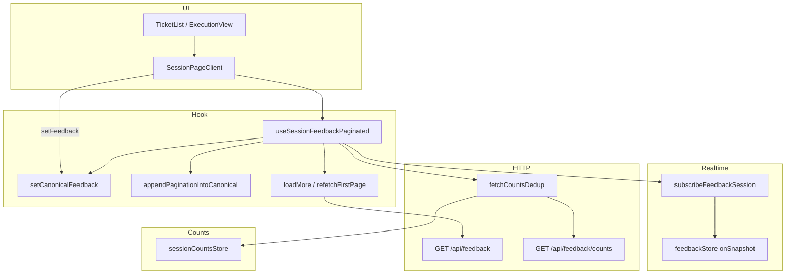

# Final Dashboard System Audit

**Scope:** `app/(app)/dashboard/**`, `lib/realtime/**`, `lib/state/**`, `lib/repositories/**` (as referenced by dashboard/API), `app/api/feedback/**`, and related session hooks/components.  
**Method:** Read-only inspection of current tree. Every factual claim below is tied to a file and line range.

---

## System architecture map

### End-to-end flow (session ticket page)

1. **Route shell** — `app/(app)/dashboard/[sessionId]/page.tsx` renders the client session UI (not fully re-read for this audit; entry is standard Next layout).

2. **Client mount** — `SessionPageClient` composes `useSessionFeedbackPaginated(feedbackSessionId, listScrollRef, listScrollReady, onNewTicketFromRealtime)` and passes `feedback` into `TicketList` / execution UI. See `SessionPageClient.tsx` where the hook is invoked and return values are destructured (e.g. feedback, setFeedback, counts, pagination fields).

3. **Counts before list** — When `sessionId` is set, `useSessionFeedbackPaginated` either uses cached counts from `sessionCountsStore` or calls `fetchCountsDedup(sessionId)` then `setStoreCounts`, and always calls `subscribeFeedbackSession(sessionId)` to start Firestore feedback realtime. See `useSessionFeedbackPaginated.ts` in the `useEffect` keyed on `[sessionId, setCanonicalFeedback]` (cold path with `fetchCountsDedup` + `subscribeFeedbackSession`).

4. **Realtime** — `subscribeFeedbackSession` in `lib/realtime/feedbackStore.ts` registers `onSnapshot` on the session feedback query (`limit(REALTIME_LIMIT)` = 30), maps docs to `Feedback` via `mapDocToFeedback`, and stores full window in `items` plus last `docChanges`.

5. **Canonical list bootstrap** — First time `feedbackRealtime.loading === false` for the active session, the hook sets `setCanonicalFeedback(realtimeItems)` once (`realtimeBootstrapDoneRef`), then marks initial load done and issues **one** `GET /api/feedback?...&cursor=&limit=20`, then `appendPaginationIntoCanonical(incoming)` for the API page. See `useSessionFeedbackPaginated.ts` “bootstrap” block (~lines 483–527).

6. **Ongoing realtime** — After bootstrap, the same effect consumes `feedbackRealtime.docChanges`: debounced `fetchCountsDedup` → `setStoreCounts`; for list rows it calls `setCanonicalFeedback` with add/modify only (`removed` skipped). See ~lines 531–585.

7. **Pagination** — Scroll listener and `IntersectionObserver` call `loadMore`, which fetches the next page and calls `appendPaginationIntoCanonical`. See `loadMore` and the two `useEffect` blocks for scroll and observer (~lines 293–401).

8. **Optimistic / user mutations** — `SessionPageClient` uses `setFeedback` (alias of `setCanonicalFeedback`) for extension insert, PATCH reconciliation, bulk resolve, delete, etc.

### Layer diagram (functions)



### Exact functions by concern

| Concern | Functions / symbols |
|--------|---------------------|
| Subscribe realtime | `subscribeFeedbackSession`, `onSnapshot`, `mapDocToFeedback`, store `setSnapshot` — `lib/realtime/feedbackStore.ts` |
| Read realtime in UI | `useFeedbackRealtimeStore` → `useSessionFeedbackPaginated` |
| Canonical list writes | `setCanonicalFeedback`, `appendPaginationIntoCanonical` (both end in `setItems`) — `useSessionFeedbackPaginated.ts` |
| Pagination fetch | `loadMore`, `cachedFetch` + `authFetch` — same file |
| Counts load | `fetchCountsDedup`, `setStoreCounts`, `subscribeCounts` — `lib/state/fetchCountsDedup.ts`, `sessionCountsStore.ts`, hook effects |
| API list shape | `GET` handler, `serializeFeedbackMinimal` — `app/api/feedback/route.ts` |

---

## Data flow trace

| Step | From | To | Mechanism |
|------|------|-----|-----------|
| Firestore docs | `feedback` collection | `feedbackStore.items` + `docChanges` | `onSnapshot` |
| Realtime window | `feedbackStore` | React list | First `loading: false` → `setCanonicalFeedback(realtimeItems)` |
| API page 1 | `/api/feedback` | List | Bootstrap `appendPaginationIntoCanonical` |
| API next pages | `/api/feedback?cursor=…` | List | `loadMore` → `appendPaginationIntoCanonical` |
| Realtime deltas | `docChanges` | List | `setCanonicalFeedback` functional update (add/modify) |
| Counts | `/api/feedback/counts` | `sessionCountsStore` | `fetchCountsDedup` + hook `subscribeCounts` |
| User actions | `SessionPageClient` | List + counts | `setFeedback` / `updateCachedCounts` |

---

## Data consistency check

### `screenshotUrl` and `screenshotStatus` in API vs realtime

**GET `/api/feedback` (session pagination):** `serializeFeedbackMinimal` explicitly sets both fields:

```146:148:app/api/feedback/route.ts
    screenshotUrl: item.screenshotUrl ?? null,
    screenshotStatus: item.screenshotStatus ?? null,
```

**Firestore realtime `Feedback` objects:** `mapDocToFeedback` sets `screenshotUrl` but **does not** read or set `screenshotStatus` anywhere in the file (confirmed: no `screenshotStatus` in `lib/realtime/feedbackStore.ts`; mapping ends with `screenshotUrl`, `commentCount`, etc. — see lines 52–82).

**Conclusion (proved):** `screenshotUrl` is present in both paths. `screenshotStatus` is **present on API-shaped rows** and **absent from realtime-mapped rows** unless it is accidentally carried by spread (it is not—mapping is explicit). So the two sources are **not** field-identical for `screenshotStatus`.

### Domain type

`Feedback` in `lib/domain/feedback.ts` includes optional `screenshotUrl` and `screenshotStatus` (lines 77–79). No contradiction; the gap is the realtime mapper not populating `screenshotStatus`.

### Firestore persistence

`feedbackPayload` in `lib/repositories/feedbackRepository.ts` writes `screenshotStatus` (lines 58–59). So the field can exist in the database while the client realtime mapper omits it.

---

## Mutation pipeline

### All writers to React `items` state

`useState` for `items` is only updated via `setItems` in two places:

- `setCanonicalFeedback` → `setItems(normalized)` — lines 159–167 in `useSessionFeedbackPaginated.ts`.
- `appendPaginationIntoCanonical` → `setItems(normalized)` — lines 221–235.

`rg "setItems\\("` on that file yields exactly those two call sites.

### Callers of those writers

- **`setCanonicalFeedback`:** session switch / no-session reset; realtime bootstrap; realtime `docChanges` apply; `refetchFirstPage`; all `SessionPageClient` paths using `setFeedback` (same reference as `setCanonicalFeedback` per hook return `setFeedback: setCanonicalFeedback` line 604).
- **`appendPaginationIntoCanonical`:** post-bootstrap API seed; `loadMore`.

### Match vs audit prompt (“ONLY … controlled optimistic updates”)

- **Yes:** There is no third `setItems` path; optimistic updates go through `setFeedback` → `setCanonicalFeedback`.
- **`appendPaginationIntoCanonical`** is a distinct code path from `setCanonicalFeedback` but is explicitly allowed in your checklist and only appends new ids (see Pagination integrity).

### Extra mutation path flag

- **`refetchFirstPage`** performs a **full list replace** via `setCanonicalFeedback(incoming)` (lines 240–262), not an append. It is **not** invoked from `SessionPageClient` or elsewhere in the codebase (`rg refetchFirstPage` only finds the hook file). So it is an **exported but unused** API surface, not an extra *active* pipeline from the UI.

---

## Realtime behavior

### `docChanges` handling

Produced in `feedbackStore.ts` lines 131–138: `added` / `modified` carry full `feedback`; `removed` carries `{ type: "removed", id }`.

### `removed`

In `useSessionFeedbackPaginated.ts`:

- Lines 553–556: logs `[ECHLY] realtime removal detected` but **does not** call `refetchFirstPage` or filter the list by removed id.
- Lines 571–572: in the apply loop, `if (change.type === "removed") continue;`

**Confirmed:** `removed` does **not** trigger a refetch or list shrink in the hook.

**Implication:** If a document is **actually deleted** (not merely evicted from the limited query window), the row can remain in the canonical list until some other refresh replaces it. This is provable from the `continue` on `removed`, not an assumption about Firestore.

### `added`

Lines 575–578: if id not in list, `unshift`; if id exists, **replace** `next[idx] = change.feedback`. **Confirmed:** existing id is updated in place rather than duplicated.

### `modified`

Lines 572–574: find index by id and assign `next[idx] = change.feedback`. **Confirmed:** in-place replacement.

---

## Pagination integrity

`appendPaginationIntoCanonical` (lines 221–235):

- Builds `Map` from **`itemsRef.current`** (current canonical rows).
- For each incoming row: `if (byId.has(item.id)) continue;` — **skips** updates for existing ids (does not overwrite fields such as `screenshotUrl`).
- Only when `appended > 0` does it write `itemsRef` + `setItems`.

**Confirmed:** It does not overwrite existing ids; it only adds new ones. Existing objects (including any fields present only on realtime rows) are preserved for shared ids.

---

## Counts system

### `feedback` list counts vs store

In `useSessionFeedbackPaginated.ts`, `total`, `activeCount`, etc. come from `counts` state (`setCountsState`), initialized from `getCounts(sessionId)` / `fetchCountsDedup` / `subscribeCounts` — see lines 77–81, 426–471, 458–457.

`total` is **not** `items.length`. `loadMore` uses `stateRef.current.total` from that counts state (line 298).

**Confirmed:** Primary displayed totals are **not** derived from `items[]` length.

### Backend-only updates (authoritative refresh)

- Initial / cold: `fetchCountsDedup` → `/api/feedback/counts` — `fetchCountsDedup.ts` lines 35–38.
- After realtime deltas: debounced `fetchCountsDuup` in hook lines 538–550.

### Optimistic count adjustments (SessionPageClient)

`ensureCountsSeeded`, `updateCachedCounts`, `applyCountTransition` mutate `sessionCountsStore` for UX (e.g. resolve, skip, extension create, delete). Proof: `SessionPageClient.tsx` blocks around lines 181–217, 295–302, 577+, 809+.

**Conclusion:** There is **one** store (`sessionCountsStore`) but **two update styles**: server-backed refresh and client optimistic deltas. That is intentional; it is not two unrelated count systems, but **dual pathways into the same store**.

---

## Failure handling

### Dashboard-scoped patterns

| Location | Pattern | Notes |
|----------|---------|------|
| `useSessionFeedbackPaginated.ts` | `catch (err) { console.error(...)` | `refetchFirstPage`, bootstrap fetch, `loadMore`, realtime apply |
| `useSessionFeedbackPaginated.ts` | `.catch((err) => console.error("[ECHLY] counts refresh failed"…))` | Debounced counts refresh |
| `SessionPageClient.tsx` | `.catch` on `recordSessionViewIfNew` | Logs error |
| `useFeedbackDetailController.ts` | `.catch(console.error)` on fire-and-forget comment sends | Errors logged, not swallowed silently |
| `useWorkspaceOverview.ts` | `await res.json().catch(() => ({}))` | **Swallows JSON parse failure** into `{}` — can mask bad bodies (lines 309, 433) |

### Empty `.catch(() => {})` outside dashboard (for completeness)

Repository-wide `rg "\\.catch\\(\\(\\)\\s*=>\\s*\\{\\s*\\}\\)"` hits e.g. `lib/authFetch.ts`, discussion components — **not** under `app/(app)/dashboard` except the `res.json().catch(() => ({}))` pattern above which is **not** strictly empty but still suppresses parse errors without logging.

**No** `catch () {}` with empty body was found in `lib/realtime` or `lib/state`.

---

## Dead code (with proof)

Each item: **file**, **lines**, **proof of no references** (workspace-wide `rg` unless noted).

1. **`refetchFirstPage` (exported from hook, never imported elsewhere)**  
   - **File:** `app/(app)/dashboard/[sessionId]/hooks/useSessionFeedbackPaginated.ts` (definition ~240–271, export in return ~605).  
   - **Proof:** `rg refetchFirstPage --glob *.{ts,tsx}` matches **only** this file.

2. **`lib/realtime/sessionsStore.ts` (entire module unused)**  
   - **Exports:** `subscribeSessionsStore`, `getSessionsSnapshot`, `useSessionsRealtimeStore`, `subscribeSessions`, `clearSessionsSubscription` (lines 48–118).  
   - **Proof:** `rg subscribeSessions|clearSessionsSubscription|getSessionsSnapshot|subscribeSessionsStore|useSessionsRealtimeStore --glob *.{ts,tsx}` matches **only** `sessionsStore.ts`.

3. **`serializeFeedback` in feedback route (defined, never called)**  
   - **File:** `app/api/feedback/route.ts` lines 99–110.  
   - **Proof:** `rg "serializeFeedback\\(" app/api/feedback/route.ts` matches **only** the function definition line, not a call site.

4. **Exported interface `PlanLimitReachedPayload` never imported outside defining file**  
   - **File:** `app/(app)/dashboard/hooks/useWorkspaceOverview.ts` lines 16–18 (export).  
   - **Proof:** `rg PlanLimitReachedPayload --glob *.{ts,tsx}` matches **only** `useWorkspaceOverview.ts`.

### Not dead (explicitly verified)

- `subscribeFeedbackStore` / `getFeedbackSnapshot`: used internally by `useFeedbackRealtimeStore` in the same file (`feedbackStore.ts`).
- `DashboardCaptureHost`: used in `app/(app)/dashboard/page.tsx`.
- `useWorkspaceOverview`, `useSessionOverview`, `useFeedbackDetailController`: have call sites in dashboard or related routes.

---

## Legacy remnants

| Remnant | Location | Evidence |
|---------|----------|----------|
| `mergeRealtimeIntoCanonical` | Docs only | `rg mergeRealtimeIntoCanonical --glob *.{ts,tsx}` → **no matches** |
| `refetchFirstPage` after realtime `removed` | Removed from behavior | Comment at `useSessionFeedbackPaginated.ts` 553–555 states removals must not refetch; no `refetchFirstPage` in realtime effect |
| Debug `console.log` | `final_dashboard_system_audit.md` | `SessionPageClient.tsx` 229–233 `[SESSION_INSIGHT_REMOVED]`; `preloadImage` logs `PRELOADING` (lines 67–73) |
| Prior audit docs (e.g. `audit/dashboard_system_analysis.md`) | `/audit/*.md` | Describe `mergeRealtimeIntoCanonical` as current — **stale vs code** |

---

## Performance observations

1. **Realtime effect churn:** Hook effect depends on `realtimeItems` (memoized from `feedbackRealtime.items`). Each snapshot replaces the `items` array reference, so the effect re-runs after bootstrap whenever Firestore pushes an update (expected cost).

2. **Dual infinite-scroll triggers:** Separate `scroll` listener (`useEffect` ~348–374) and `IntersectionObserver` (~377–401) both call `loadMore`; guarded by `isFetchingRef` and `loadingMore`. Redundant but bounded by locks.

3. **`IntersectionObserver` re-subscription:** Effect depends on `items.length` (~401), so the observer is torn down/recreated when the list grows—simple but not minimal overhead.

4. **`SelectionMemory` / open queue:** `openFeedback = useMemo(() => feedback.filter(...), [feedback])` in `SessionPageClient.tsx` (163–166)—full-list scan on each `feedback` change; typical sizes make this acceptable.

5. **`stateRef` mirror:** Updated every render with `items`, `total`, `cursor`, etc.— standard pattern to avoid stale closures in async `loadMore`.

---

## FINAL VERDICT

| Question | Answer | Reason (short) |
|----------|--------|----------------|
| **Deterministic** | **NO** (for cross-source shape); **YES** (for canonical mutation rules) | Same logical ticket can carry `screenshotStatus` from API but not from realtime mapper; removed Firestore events do not remove list rows—behavior is deliberate but not “fully consistent” across sources. |
| **Clean** | **NO** | Unused `sessionsStore` module, unused `refetchFirstPage` export, dead `serializeFeedback`, stray debug logs, stale audit prose elsewhere. |
| **Production-ready** | **CONDITIONAL** | Core session list, pagination, counts refresh, and closed `setItems` surface are coherent; ship with awareness of realtime/API field gap and non-removal of deleted rows on `removed` deltas. |

---

*End of audit. No code was modified during this review.*
