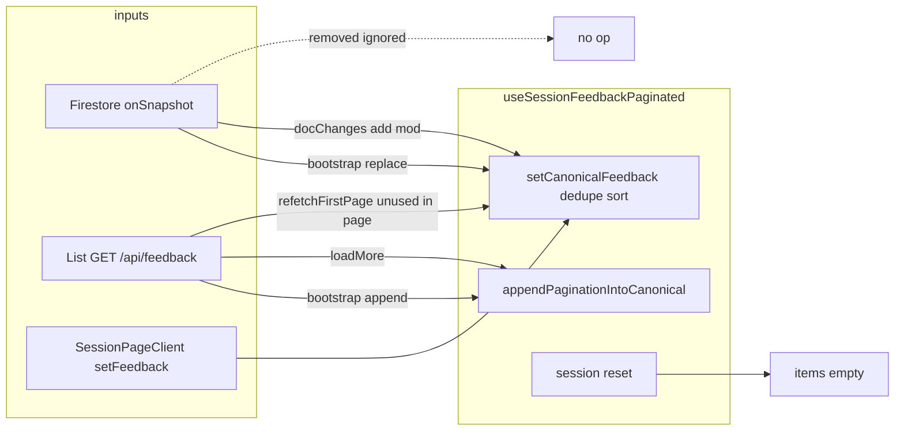

# Post Phase 4 System Analysis

Evidence is taken from the current repo state (`echly-extension/src/background.ts`, `echly-extension/src/content.tsx`, `app/(app)/dashboard/[sessionId]/hooks/useSessionFeedbackPaginated.ts`, `app/(app)/dashboard/[sessionId]/SessionPageClient.tsx`, `lib/realtime/feedbackStore.ts`, `lib/state/sessionCountsStore.ts`, `lib/state/fetchCountsDedup.ts`, `lib/state/countsRequestStore.ts`, `app/api/feedback/route.ts`, `app/api/feedback/counts/route.ts`). This document traces execution only; it is not a recommendation or fix list.

---

## End-to-End Flow

### 1. Start session from extension

| Step | Trigger | Functions / handlers | State updates | UI |
|------|---------|---------------------|---------------|-----|
| User starts session from widget | `CaptureWidget` / session flows in `content.tsx` | `createSession()` → `POST /api/sessions` via `apiFetch`; on success `chrome.runtime.sendMessage({ type: "ECHLY_SET_ACTIVE_SESSION", sessionId })` | **Background:** `activeSessionId`, `globalUIState.sessionId`, counts zeroed, `resetPaginationState()`, storage `activeSessionId`; then async `rehydrateSession(sessionId)` → `GET /api/feedback` (first page) + `fetchFeedbackCountFresh` → `GET /api/feedback/counts` | **Content:** receives `ECHLY_GLOBAL_STATE` messages; `normalizeGlobalState` → React `globalState`; tray shows session + pointers from background |
| Parallel | `ECHLY_SESSION_MODE_START` (multiple call sites in `content.tsx`) | Background: `sessionModeActive`, idle timer | `broadcastUIState` → tabs |

**Dashboard:** Not in this path until the user opens `/dashboard/[sessionId]` in the web app. Opening that page runs `SessionPageClient` effects: `ECHLY_SET_ACTIVE_SESSION` to extension (lines 236–252), session doc `getDoc` for title/ownership only.

### 2. Create feedback

| Step | Trigger | Functions | State | UI |
|------|-----------|-----------|-------|-----|
| Capture pipeline completes | `processFeedbackPipeline` in `content.tsx` | `uploadScreenshot` → `chrome.runtime.sendMessage({ type: "ECHLY_CREATE_FEEDBACK", payload })` | **Background:** `createFeedbackInternal` → `POST /api/feedback` | **Extension tray:** after `notifyFeedbackCreated`, background handler `ECHLY_FEEDBACK_CREATED` prepends `globalUIState.pointers` and `mutateGlobalCounts` (+1 total, +1 open); `broadcastUIState` |
| Same tab, web app | `notifyFeedbackCreated` sends runtime message to background only | No `tabs.sendMessage` with `ECHLY_FEEDBACK_CREATED` from background for this path | N/A | **Dashboard list:** does **not** receive `window` `ECHLY_FEEDBACK_CREATED` from the successful create path (see §Realtime / §UI Consistency) |

### 3. Dashboard receives update

| Source | Mechanism |
|--------|-----------|
| Firestore | `subscribeFeedbackSession(sessionId)` in `useSessionFeedbackPaginated` → `onSnapshot` in `feedbackStore.ts` → module `snapshot` updated → `useFeedbackRealtimeStore` subscribers run |
| First snapshot | Hook effect: `realtimeBootstrapDoneRef === false` → `setCanonicalFeedback(realtimeItems)` (replace with up to **30** docs, `REALTIME_LIMIT`) |
| After bootstrap | Same effect runs **sequential** `GET /api/feedback?cursor=&limit=20` → `appendPaginationIntoCanonical(apiItems)`; `setCursor`, `setHasMore(data.hasMore ?? false)` |
| Increments | `docChanges` loop → `setCanonicalFeedback` (add/modify only; `removed` skipped — see §Realtime) |

**Counts on dashboard:** `fetchCountsDedup` → `GET /api/feedback/counts` → `setCounts` in `sessionCountsStore`; `subscribeCounts` copies into hook `counts` state. If `getCounts(sessionId)` already populated, the session effect **skips** the fetch and only `subscribeFeedbackSession` + `subscribeCounts`.

### 4. User scrolls (pagination) — dashboard

| Step | Trigger | Functions | State | UI |
|------|---------|-----------|-------|-----|
| Scroll | `scroll` listener on `scrollContainerRef` (`useSessionFeedbackPaginated`) | After first real scroll (`hasUserScrolledRef`), near-bottom threshold → `loadMore()` | `isFetchingRef`, `loadingMore`; `GET /api/feedback?cursor=…&limit=20`; `appendPaginationIntoCanonical`; `setCursor`; `setHasMore` from `total` (counts) vs loaded length or API `hasMore` if `total === 0` | `TicketList` shows more rows; `loadingMore` |
| Sentinel | `IntersectionObserver` on `loadMoreRef` | Same `loadMore()` if `hasUserScrolledRef` true | same | same |

**Note:** Dashboard does **not** use the `ECHLY_LOAD_MORE` runtime message; that path is **extension-only** (`background.ts` → `loadMore()`).

### 5. User edits / deletes feedback — dashboard

| Action | Trigger | Functions | `items` / counts |
|--------|---------|-----------|------------------|
| Title, action steps, tags | UI save | `authFetch` `PATCH /api/tickets/:id` | `setFeedback` (`setCanonicalFeedback`) optimistic then merge server ticket |
| Resolve / skip | UI | `PATCH`; `applyCountTransition` → `updateCachedCounts` | Optimistic row + counts; rollback + `setCachedCounts` on failure |
| Delete | Modal confirm | `handleDeleteFeedback`: filter list, `updateCachedCounts`, `DELETE /api/tickets/:id`; on failure restore list + counts | Local list removes row immediately |

**Extension tray** title updates: `SessionPageClient` `broadcastTicketUpdated` → `chrome.runtime.sendMessage({ type: "ECHLY_TICKET_UPDATED" })` → background maps `pointers` (not used for dashboard list).

---

## Data Ownership

| Data | Owner (authoritative for dashboard UI) | Who updates it | Mutation paths (count) |
|------|----------------------------------------|----------------|------------------------|
| **`items[]` (canonical list)** | React state `items` inside `useSessionFeedbackPaginated`, written only via `setItems` / `setCanonicalFeedback` / `appendPaginationIntoCanonical` | Hook effects + `setFeedback` exposed to `SessionPageClient` | Realtime bootstrap replace (1× per session); realtime `docChanges` (ongoing); initial API append after bootstrap; `loadMore` append; `refetchFirstPage` full replace (exported, **not** used by `SessionPageClient`); session reset clears; `SessionPageClient` optimistic/event handlers call `setFeedback`. **Multiple paths.** |
| **`cursor`** | React state `cursor` in hook | Set from API `nextCursor` or last item id fallback on first page refetch / bootstrap API / `loadMore` | `refetchFirstPage`, bootstrap API block, `loadMore`; cleared on error/session reset. |
| **`hasMore`** | React state `hasMore` in hook | Derived jointly from **`counts.total`** (when `total > 0`) and loaded length; else API `hasMore` | Initial bootstrap uses API only; `loadMore` uses `s.total`; refetch uses `getCounts(sid)?.total`; failures force `false`. |
| **`counts` (total/open/resolved/skipped)** | **`sessionCountsStore`** (module `Map`) is shared source; hook mirrors into `counts` state via `subscribeCounts` | `setCounts` after `fetchCountsDedup`; `SessionPageClient` `setCachedCounts` / `updateCachedCounts` on optimistic UI; extension has **separate** in-memory `countsBySessionId` + `globalUIState` counts — **not** the dashboard store | Dashboard: HTTP `/api/feedback/counts`; optimistic patches from ticket transitions; `ensureCountsSeeds` seeds from hook counts into store if missing. Extension: `fetchFeedbackCountFresh`, `mutateGlobalCounts`, `ECHLY_REFETCH_FEEDBACK_COUNT` mutations. **No shared JS heap between extension and web app.** |

---

## Realtime Behavior

1. **Subscription:** `subscribeFeedbackSession` registers `onSnapshot` on `collection("feedback")` with `where sessionId`, `orderBy createdAt desc`, `limit(30)`.

2. **Each snapshot** (`feedbackStore.ts`):
   - `items` is **fully replaced** with `snap.docs.map(mapDocToFeedback)`.
   - `docChanges` is populated from `snap.docChanges()` as `added` | `modified` | `removed` (with id for removed).

3. **Consumer** (`useSessionFeedbackPaginated`):
   - **Bootstrap (`realtimeBootstrapDoneRef === false`):** replaces canonical list with `realtimeItems` (the store’s full window, up to 30).
   - **After bootstrap:** iterates `feedbackRealtime.docChanges`. **`if (change.type === "removed") continue;`** — removals are **not** applied to the canonical list.
   - **Added:** `next.unshift` then dedupe/sort via `setCanonicalFeedback`.
   - **Modified:** replace by id in `next` array then `setCanonicalFeedback`.

**Answer:** The Firestore store **rebuilds** its `items` every snapshot. The dashboard hook **does not** mirror that full rebuild after bootstrap; it applies **single-item-style** deltas from `docChanges` only, and **explicitly ignores** `removed`.

---

## Pagination Flow

| Concern | Location / behavior |
|---------|---------------------|
| **Dashboard trigger** | Scroll listener + `IntersectionObserver` (both call `loadMore`); **not** `ECHLY_LOAD_MORE`. |
| **Cursor storage** | React `cursor` state; `sessionIdRef` guards stale responses. |
| **`hasMore` derivation** | If `stateRef.current.total > 0`: `loadedCount + appended < s.total` (after load) or scroll gating uses `loadedCount < totalCount`. If `total === 0`: uses API `hasMore`. |
| **What blocks `loadMore`** | No `sessionId`; `!initialLoadDone`; `loadingMore` or `isFetchingRef`; `loadedCount >= FEEDBACK_LOAD_CAP` (200); `loadedCount >= total` when `total > 0`; `!hasMore`. |
| **Extension** | `ECHLY_LOAD_MORE` → `loadMore()` uses `globalUIState.nextCursor` and `globalUIState.hasMore` from **list** API only; on failure sets `recovering`, retries `rehydrateSession` with backoff. |

---

## Counts Flow

| Stage | Behavior |
|-------|----------|
| **Origin** | `GET /api/feedback/counts` → server `resolveSessionFeedbackCounts` (Firestore-backed session aggregation). |
| **Dashboard load** | Uncached: `fetchCountsDedup` (deduped per `sessionCountsStore` pending promise via `countsRequestStore`) → `setStoreCounts` → `subscribeCounts` updates hook. Cached: read `getCounts` in effect, skip network for that branch. |
| **When counts update** | After fetch completes; on every `updateCachedCounts` / `setCachedCounts` from `SessionPageClient` optimistic flows; **not** automatically incremented by Firestore listener in `feedbackStore` (counts are separate HTTP + optimistic). |
| **Sync with realtime** | **Partial:** ticket rows can change from Firestore `modified` while counts only change when user actions run optimistic math or a new `/counts` fetch runs. New tickets eventually align when server counts are refetched or optimistic creates adjust store — but realtime **does not** push count integers to `sessionCountsStore`. |

---

## Failure Handling

| Scenario | Dashboard behavior | Extension behavior |
|----------|-------------------|---------------------|
| **`GET /api/feedback` failure** (bootstrap API after realtime) | `catch`: `setHasMore(false)`, `setCursor(null)` | `rehydrateSession` / cold paths may clear pointers; soft stale mode keeps list on some errors |
| **`loadMore` failure** | `finally` clears fetch flags; **no** `catch` body — failed response still parsed if `res.ok`; network throw would skip JSON — **behavior depends on `cachedFetch` / `authFetch` throwing** | `loadMore` **catch**: `recovering`, `hasMore = true`, `retryRehydrateWithBackoff` |
| **`fetchCountsDedup` failure** | `setCountsLoading(false)` only; counts may stay zeros / stale cache | N/A |
| **Realtime `onSnapshot` error** | `feedbackStore` sets `items: []`, `docChanges: []`, `error` string, `loading: false` | N/A |

**UI break?** Empty realtime `items` + error state does not by itself clear hook `items` except through effects that read `realtimeItems` — after bootstrap, empty store items with `docChanges` length 0 returns early; existing canonical list can **remain** until session change.

**Silent failures:** Several `catch {}` blocks in `SessionPageClient` (e.g. `broadcastTicketUpdated`); scroll `loadMore` has no user-visible error state in the hook beyond `hasMore` / loading flags.

---

## Race Conditions

| Scenario | Evidence |
|----------|----------|
| **Realtime during pagination** | `loadMore` uses `appendPaginationIntoCanonical` (id dedupe). Concurrent `setCanonicalFeedback` from `docChanges` uses `itemsRef.current` / functional updates; **possible interleaving** of snapshot version and pagination completion order. |
| **Pagination during realtime** | `isFetchingRef` serializes `loadMore`; realtime effect still runs and can call `setCanonicalFeedback` while fetch in flight. |
| **Edits during both** | `SessionPageClient` maps by `selectedId` into `setFeedback`; same id updates merge; ordering re-sorted by `createdAt` + id tiebreak. |
| **Session switch** | `sessionIdRef.current !== startedSessionId` / `effectSessionId` checks drop in-flight API results. |

---

## UI Consistency

| Question | Evidence |
|----------|----------|
| **Duplicates** | `setCanonicalFeedback` and `appendPaginationIntoCanonical` dedupe by **id** (`Map`). |
| **Missing items** | Items only on Firestore listener window (30) until API pagination loads deeper pages; **ticket older than loaded pages + not in 30-window** may be missing until user scrolls. |
| **`removed` / delete elsewhere** | `removed` docChanges **ignored** → row can **remain** after server deletion if delete happened outside this client’s optimistic path. |
| **Order stability** | Global sort `sortByCreatedAtDesc` after each canonical update (`getTimestamp` handles ISO strings, Firestore timestamps, `clientTimestamp`). Tie-break `id`. |
| **Scroll stability** | List grows downward; no explicit scroll restoration in hook; sentinel + threshold refetch can shift layout as rows append. |

---

## Mutation Paths (complete list for dashboard `items[]`)

1. **Session reset:** `useLayoutEffect` on `sessionId` → `setItems([])`.
2. **No session:** effect sets `setItems([])`.
3. **Realtime bootstrap:** `setCanonicalFeedback(realtimeItems)`.
4. **Post-bootstrap API seed:** `appendPaginationIntoCanonical(incoming)`.
5. **`loadMore`:** `appendPaginationIntoCanonical(incoming)`.
6. **`refetchFirstPage`:** `setCanonicalFeedback(incoming)` — **no call sites in `SessionPageClient`** (only returned from hook).
7. **Realtime `docChanges`:** `setCanonicalFeedback` with add/modify only.
8. **Optimistic / UI (`SessionPageClient`):** `setFeedback` for create event, title, actions, tags, resolve, skip, mark-all, delete, `ECHLY_FEEDBACK_CREATED` handler.

**Extension tray list (`pointers`)** is a **separate** mutation surface (rehydrate, loadMore, ECHLY_FEEDBACK_CREATED, ECHLY_SET_ACTIVE_SESSION, ticket updated, session end, etc.).

---

## `ECHLY_FEEDBACK_CREATED` / dashboard bridge

- `content.tsx` **`notifyFeedbackCreated`** → `chrome.runtime.sendMessage({ type: "ECHLY_FEEDBACK_CREATED", … })` to the **background** only.
- **Background** handler updates tray state and `broadcastUIState` (`ECHLY_GLOBAL_STATE`); it does **not** `tabs.sendMessage` with `ECHLY_FEEDBACK_CREATED`.
- **Content** dispatches `window` `CustomEvent("ECHLY_FEEDBACK_CREATED")` only inside `chrome.runtime.onMessage` when **receiving** `ECHLY_FEEDBACK_CREATED` from the runtime — which does **not** occur for the content→background notify path.
- **`SessionPageClient`** listens for that window event: **Evidence:** under default extension create flow, that listener is **not** fired by `notifyFeedbackCreated`. Dashboard inserts for new tickets rely on **Firestore `docChanges` / bootstrap**, not this event.

---

## Final Verdict

1. **Determinism — LOW.** Multiple writers (realtime window, paginated REST, optimistic UI), conditional `hasMore` logic (`total === 0` vs `total > 0`), and ignored delete deltas reduce predictability of list equality vs server.

2. **Complexity — HIGH.** Parallel architectures: extension `globalUIState` + recovery pagination; dashboard `feedbackStore` + `sessionCountsStore` + hook merge rules; two feedback HTTP surfaces (`/api/feedback`, `/api/feedback/counts`).

3. **Reliability — FAIL** (for **list/count correctness** vs Firestore): traceable gap on **`removed`** docChanges; **`ECHLY_FEEDBACK_CREATED` → dashboard** bridge not connected on the successful create path; counts are **not** realtime-driven. For **availability** (crashes, extension retry on pagination), behavior is more robust — the single-word rating reflects **semantic** consistency per scope (extension + dashboard session list).

---

## System complexity map (dashboard `items[]` only)

---

*End of post–Phase 4 system analysis.*
