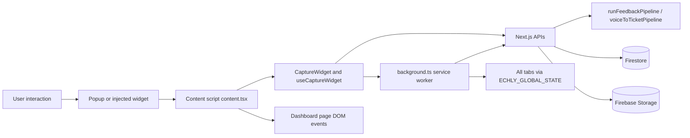
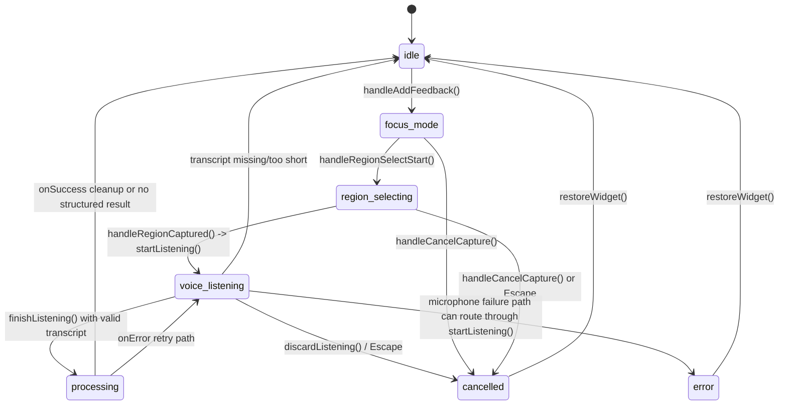
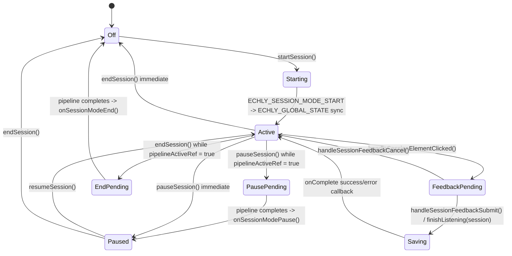
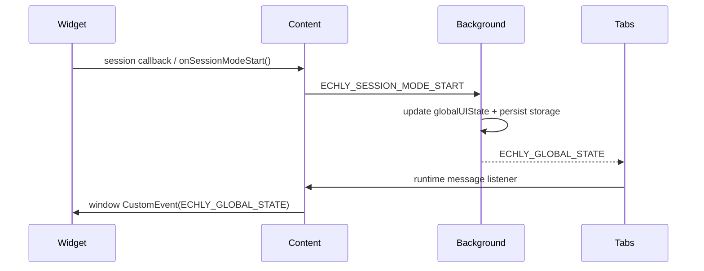
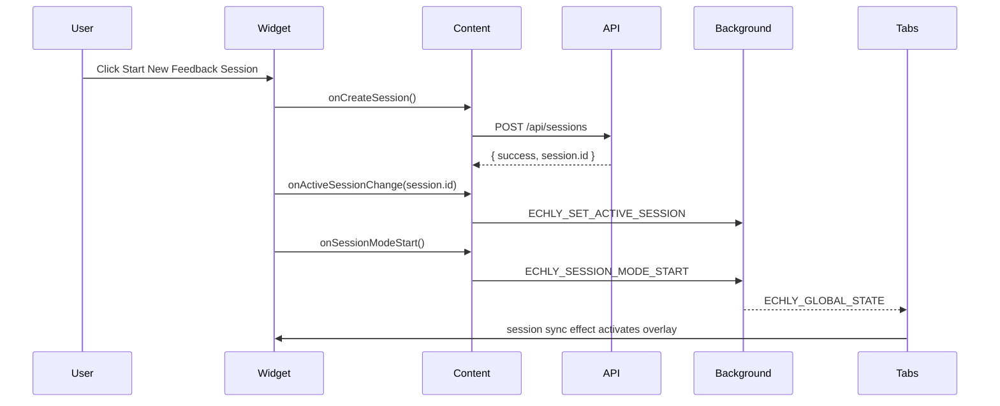
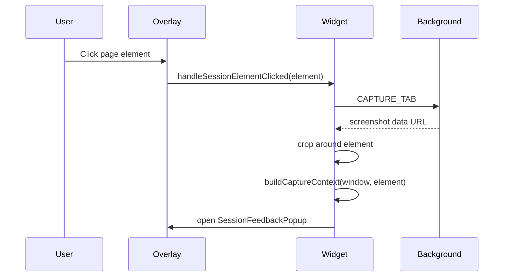
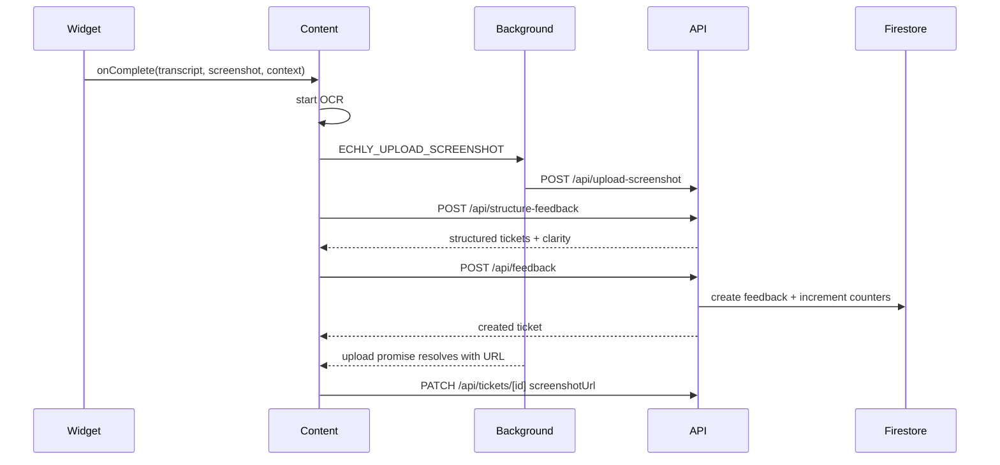
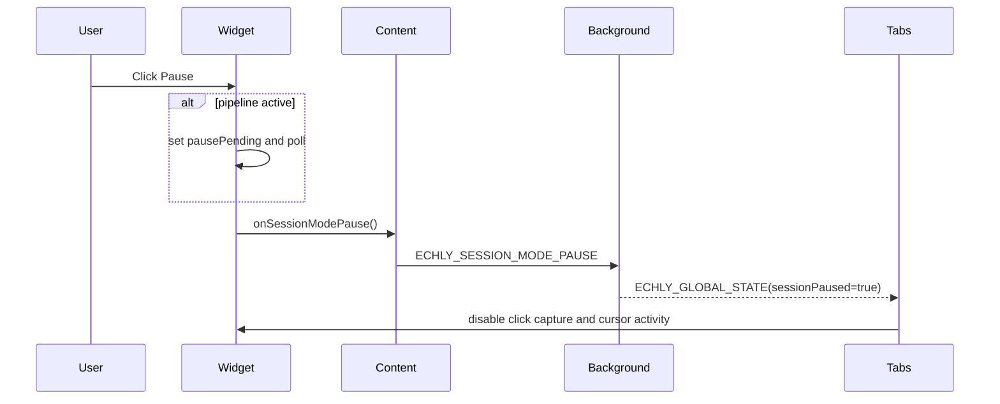
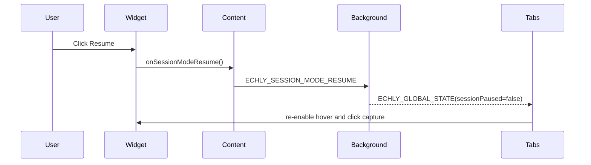
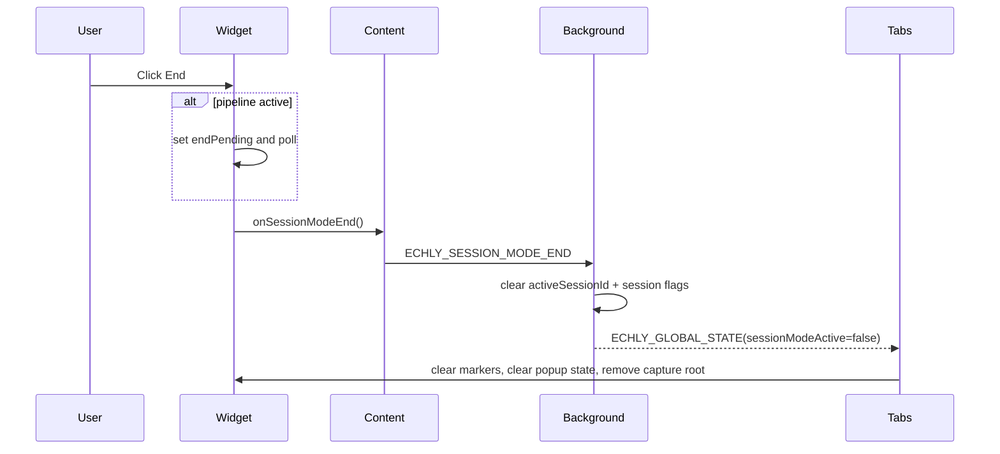

# Echly Browser Extension Architecture Reference

## Document Purpose

This document is a technical architecture reference for the Echly browser extension and its connected web application/backend systems. It is written for diagnosis, stabilization, and future refactoring. The emphasis is on runtime behavior, ownership boundaries, state synchronization, message routing, asynchronous execution, and persistence semantics.

This document does not describe only the UI. It explains how the extension, injected widget, capture overlays, AI structuring pipeline, API routes, and Firestore-backed storage cooperate at runtime.

## Scope

This reference covers:

- Browser extension runtime components in `echly-extension/`
- Widget runtime and session capture logic in `components/CaptureWidget/`
- Context collection in `lib/captureContext.ts`
- AI structuring pipeline in `lib/ai/*`
- Session and ticket APIs in `app/api/*`
- Firestore persistence and screenshot lifecycle repositories
- Dashboard/session page synchronization with the extension

This reference treats TypeScript source files as the source of truth. Built artifacts such as `echly-extension/background.js` and `echly-extension/content.js` are outputs, not the primary design authority.

## Terminology

| Term | Meaning |
| --- | --- |
| Extension service worker | `echly-extension/src/background.ts`; owns auth state, global UI state, cross-tab session state, screenshot capture, and privileged fetches |
| Content script | `echly-extension/src/content.tsx`; injected into every page, mounts the widget UI, runs the client-side submission pipeline, and bridges background messages into DOM events |
| Widget | The React UI rooted at `#echly-root` inside the extension shadow DOM |
| Capture root | The full-screen portal root `#echly-capture-root` appended to `document.body` for region/session overlays |
| Session mode | Multi-feedback click-capture mode used to collect multiple feedback items sequentially during an active session |
| Pointer / ticket pointer | Local sidebar representation of saved feedback items shown in the widget |
| Structure pipeline | `/api/structure-feedback` plus `lib/ai/runFeedbackPipeline.ts` and `lib/ai/voiceToTicketPipeline.ts` |
| Feedback persistence | `/api/feedback`, `/api/tickets/[id]`, and Firestore repositories under `lib/repositories/` |
| Global UI state | Cross-tab state broadcast by `background.ts`, including visibility, expansion, active session, session mode, and pause status |

---

## 1. System Overview

### 1.1 High-Level Architecture

At runtime Echly is a distributed system composed of five cooperating layers:

1. Browser extension shell
2. Injected page UI and capture overlays
3. Next.js application/API layer
4. AI structuring pipeline
5. Firestore and Firebase Storage persistence

The key design choice is that the extension is split between:

- a privileged service worker that owns tokens, global tab state, and browser APIs
- an injected content script that owns the widget UI and the first half of the feedback pipeline

The widget does not directly own global session state across tabs. Instead, it reacts to `ECHLY_GLOBAL_STATE` from the background service worker.

### 1.2 Major Subsystems And Their Purpose

#### Browser extension components

- `echly-extension/src/background.ts`
  - Privileged control plane
  - Stores authentication tokens in `chrome.storage.local`
  - Refreshes Firebase ID tokens
  - Persists active session lifecycle flags across service-worker restarts
  - Captures the visible tab image through `chrome.tabs.captureVisibleTab`
  - Broadcasts global extension UI state to all tabs
  - Receives and serves all extension runtime messages

- `echly-extension/src/content.tsx`
  - Injected UI runtime
  - Creates a shadow DOM host so the widget is isolated from page CSS
  - Renders `CaptureWidget`
  - Runs the client-side feedback completion flow:
    - OCR
    - screenshot upload kickoff
    - structuring request
    - feedback creation
    - later screenshot patch
  - Converts runtime messages into `window` events for page-local consumers

- `echly-extension/src/popup.tsx`
  - Extension popup entrypoint
  - If authenticated, toggles widget visibility and closes immediately
  - If unauthenticated, starts Google sign-in via background messaging

#### Widget UI

- `components/CaptureWidget/*`
  - React UI for browsing, editing, and creating feedback
  - Owns local widget state such as sidebar open/closed, edited ticket fields, active recording, and local marker list
  - Owns session mode click-capture flow inside the page
  - Uses a full-screen capture root outside the sidebar to avoid overlay/layout conflicts

#### Capture system

- Region capture mode
  - Used for one-off feedback capture
  - User drags a region, confirms it, then speaks feedback
  - The system crops the screenshot to the selected rectangle and builds DOM context around the capture center

- Session mode
  - Used for repeated element-targeted feedback creation
  - User starts a session once, then clicks multiple page elements
  - Each click crops around the element, builds context, opens a popup, and collects voice or typed feedback
  - Optimistic markers are placed immediately so the user can continue capturing without waiting for AI/persistence

#### AI processing pipeline

- `/api/structure-feedback`
  - Accepts transcript and context
  - Calls the OpenAI-backed structuring pipeline
  - Returns one logical ticket in a compatibility `tickets[]` array
  - Returns clarity metadata (`clarityScore`, `needsClarification`, `suggestedRewrite`, `confidence`)

- `lib/ai/voiceToTicketPipeline.ts`
  - Normalizes raw DOM context
  - Truncates context into a token budget
  - Calls the LLM with a strict JSON schema
  - Optionally performs a review pass when confidence is below threshold
  - Returns a single ticket with title, action steps, and clarity metadata

#### Firestore persistence

- `feedback` collection
  - Stores created tickets
  - Stores title, description, action steps, screenshot URL, clarity fields, and metadata
  - Stores status as `open`, `resolved`, or `skipped`

- `sessions` collection
  - Stores session ownership and denormalized counters
  - Tracks `openCount`, `resolvedCount`, `skippedCount`, `feedbackCount`, `updatedAt`

- `screenshots` collection
  - Tracks screenshot upload lifecycle
  - Starts as `TEMP`
  - Becomes `ATTACHED` once associated with a ticket

- Firebase Storage
  - Holds actual PNG screenshot files under `sessions/{sessionId}/screenshots/{screenshotId}.png`

### 1.3 Control Ownership Model

The system uses four separate ownership domains:

- Background owns cross-tab/global state and auth
- Content script owns page-local UI and submission orchestration
- `useCaptureWidget()` owns local capture/session state within a single page
- Next.js APIs own validation, AI invocation, and persistence

This separation is useful, but it also creates synchronization risk because the same user action often crosses all four domains.

### 1.4 End-To-End Runtime Diagram

### 1.5 Primary Data Paths

#### Authentication path

1. Popup asks background for auth state.
2. If unauthenticated, popup sends `ECHLY_START_LOGIN`.
3. Background performs Google OAuth with `chrome.identity.launchWebAuthFlow`.
4. Background exchanges the Google ID token for Firebase tokens.
5. Tokens and user metadata are stored in `chrome.storage.local`.
6. Content/API requests later reuse background-managed token refresh.

#### Session control path

1. Widget requests session creation/resume.
2. Content script calls `/api/sessions` or loads session feedback.
3. Content script notifies background with `ECHLY_SET_ACTIVE_SESSION`.
4. Content script notifies background with `ECHLY_SESSION_MODE_*`.
5. Background updates `globalUIState`, persists lifecycle fields, and broadcasts to all tabs.
6. Each content script updates local widget/session overlay state from `ECHLY_GLOBAL_STATE`.

#### Feedback submission path

1. Widget captures screenshot and transcript.
2. Content script starts OCR and screenshot upload in parallel.
3. Content script calls `/api/structure-feedback`.
4. Content script decides:
   - clarity assistant
   - fallback `ECHLY_PROCESS_FEEDBACK`
   - direct `/api/feedback` creation
5. Content script later patches `/api/tickets/[id]` with `screenshotUrl` after upload completes.
6. Background or content script broadcasts ticket creation to tabs and the dashboard.

---

## 2. File Responsibility Map

### 2.1 Capture Widget Directory

The `components/CaptureWidget/` directory is a feature bundle. It contains:

- the visible sidebar UI
- the region/session overlay system
- capture-state orchestration
- local editing behaviors
- session-specific DOM helpers

#### `components/CaptureWidget/CaptureWidget.tsx`

Top-level composition component for the widget. Responsibilities:

- calls `useCaptureWidget()`
- decides whether to show the floating trigger, sidebar panel, paused session control panel state, or capture layer
- wires extension-controlled open/collapse behavior
- loads resume-session modal in extension mode
- passes full session overlay handlers into `CaptureLayer`

This file is not the state engine; it is the rendering and wiring shell.

#### `components/CaptureWidget/hooks/useCaptureWidget.ts`

Primary runtime coordinator for the widget. This is the most important file in the browser-side capture architecture. Responsibilities:

- stores the capture state machine (`idle`, `focus_mode`, `region_selecting`, `voice_listening`, `processing`, `cancelled`, `error`)
- stores local ticket pointer state for the sidebar
- stores local session mode state (`sessionMode`, `sessionPaused`, `pausePending`, `endPending`)
- creates and removes `#echly-capture-root`
- creates `#echly-marker-layer`
- starts/stops Web Speech recognition
- captures mic audio levels for animated UI
- manages session feedback popup state
- places optimistic markers before AI/persistence completes
- waits for in-flight pipelines before pause/end completes
- synchronizes local state from background-provided global session state

Key functions:

- `createCaptureRoot()`
- `removeCaptureRoot()`
- `startListening()`
- `finishListening()`
- `discardListening()`
- `handleRegionCaptured()`
- `startSession()`
- `pauseSession()`
- `resumeSession()`
- `endSession()`
- `handleSessionElementClicked()`
- `handleSessionFeedbackSubmit()`
- `handleSessionStartVoice()`
- `handleAddFeedback()`

#### `components/CaptureWidget/CaptureLayer.tsx`

Portal router for full-screen overlays. Responsibilities:

- mounts region-capture overlay when in one-off capture mode
- mounts session overlay when `sessionMode && extensionMode`
- ensures overlays render into `#echly-capture-root`, not into the sidebar tree

#### `components/CaptureWidget/RegionCaptureOverlay.tsx`

Region selection overlay for one-off capture. Responsibilities:

- draws the dimmed screen overlay
- handles mouse drag selection
- handles ESC cancellation
- crops the captured full-tab image to the selected rectangle
- chooses a DOM element near the capture center
- builds `CaptureContext` for AI
- triggers `onAddVoice(croppedDataUrl, context)`

#### `components/CaptureWidget/SessionOverlay.tsx`

Full-screen session-mode interaction shell. Responsibilities:

- attaches element highlighter
- attaches click interception in capture phase
- changes the cursor into a comment bubble cursor
- shows hover tooltip `"Click to add feedback"`
- shows `SessionControlPanel`
- opens `SessionFeedbackPopup` when an element has been captured

#### `components/CaptureWidget/SessionControlPanel.tsx`

Stateless top-center session control bar. Responsibilities:

- reflects `sessionPaused`, `pausePending`, and `endPending`
- prevents duplicate actions through disabled button states
- provides the visual surface for pause/resume/end controls

#### `components/CaptureWidget/SessionFeedbackPopup.tsx`

Popup used after a session-mode click capture. Responsibilities:

- previews the clicked element screenshot crop
- lets the user choose between voice and typed feedback
- exposes `choose -> voice` and `choose -> text` UI microstates
- calls `onRecordVoice`, `onDoneVoice`, `onSaveText`, and optional discard

#### `components/CaptureWidget/WidgetFooter.tsx`

Idle-state action footer. Responsibilities:

- in web mode: shows `Capture feedback`
- in extension mode: shows `Start New Feedback Session`, `Resume Session`, and `Open Previous Session`
- computes disabled states for capture/session buttons

#### `components/CaptureWidget/ResumeSessionModal.tsx`

Modal for listing prior sessions. Responsibilities:

- fetches sessions on open
- filters by search and recency
- renders counts and updated time
- returns the selected session ID back to the widget

#### `components/CaptureWidget/CaptureHeader.tsx`

Sidebar header. Responsibilities:

- displays title/summary
- exposes theme toggle
- exposes close/collapse action

#### `components/CaptureWidget/FeedbackItem.tsx`

Single ticket pointer row in the sidebar. Responsibilities:

- computes a UI priority badge from `type`
- renders expand/edit/delete actions
- supports inline editing and save feedback
- highlights newly created tickets

#### `components/CaptureWidget/FeedbackList.tsx`

Simple list wrapper around `FeedbackItem`. Mostly composition and memoization.

#### `components/CaptureWidget/MicOrb.tsx`

Reusable microphone orb visual component used for recording feedback UI animations.

#### `components/CaptureWidget/RecordingMicOrb.tsx`

Larger mic orb visualization with audio-level-driven scaling for recording states.

#### `components/CaptureWidget/types.ts`

Shared widget contracts:

- `CaptureState`
- `Recording`
- `CaptureContext`
- `StructuredFeedback`
- `CaptureWidgetProps`

Important note: `CaptureState` includes `success`, but the current implementation does not actually transition into `success`.

#### `components/CaptureWidget/index.tsx`

Simple re-export of `CaptureWidget`.

### 2.2 Capture Widget Session Helpers

#### `components/CaptureWidget/session/sessionMode.ts`

Session-mode safety layer. Responsibilities:

- debug logging via `logSession()`
- determines whether an element is a valid session capture target
- excludes:
  - Echly UI
  - shadow host
  - form controls
  - contenteditable elements

#### `components/CaptureWidget/session/clickCapture.ts`

Document-level click interception. Responsibilities:

- attaches capture-phase click listener
- prevents default navigation or interaction for valid targets
- forwards only approved elements to the session capture callback

#### `components/CaptureWidget/session/elementHighlighter.ts`

Non-React hover outline manager. Responsibilities:

- tracks the element under the pointer
- maintains a single overlay box without React re-renders
- hides itself when session capture is inactive

#### `components/CaptureWidget/session/feedbackMarkers.ts`

DOM-based marker system for session mode. Responsibilities:

- creates numbered markers on clicked elements
- updates marker title and ID after async persistence completes
- repositions markers on scroll/resize if the original element still exists
- removes individual failed markers
- clears all markers when the session ends

#### `components/CaptureWidget/session/cropAroundElement.ts`

Crop utility for session mode. Responsibilities:

- computes a padded region around a clicked element
- clamps the crop region to viewport bounds
- reuses `cropImageToRegion()` from `RegionCaptureOverlay.tsx`

### 2.3 Extension Runtime Files

#### `echly-extension/src/background.ts`

Privileged service worker and control plane. Responsibilities:

- stores auth tokens and user metadata
- refreshes expired Firebase ID tokens
- stores `activeSessionId`
- stores and broadcasts `globalUIState`
- persists lifecycle state in `chrome.storage.local`
- handles browser identity sign-in
- handles screenshot capture
- handles screenshot upload API call
- provides authenticated fetch proxy for content scripts
- provides fallback feedback processing path

#### `echly-extension/src/content.tsx`

Injected React runtime and page-local orchestration layer. Responsibilities:

- creates `#echly-shadow-host` on `document.documentElement`
- attaches shadow root and CSS
- renders `CaptureWidget`
- requests auth state and global UI state from background
- forwards page session ID to background on dashboard pages
- implements `handleComplete()`, the core client-side submission boundary
- broadcasts `ECHLY_GLOBAL_STATE` and `ECHLY_FEEDBACK_CREATED` as DOM events
- handles clarity assistant UI in extension mode

#### `echly-extension/src/contentScreenshot.ts`

Small helper module. Responsibilities:

- generates feedback/screenshot IDs
- starts `ECHLY_UPLOAD_SCREENSHOT`
- returns a promise resolving to the final screenshot URL

#### `echly-extension/src/ocr.ts`

Client-side OCR helper. Responsibilities:

- dynamically imports `tesseract.js`
- recognizes text from screenshot data URLs
- returns trimmed visible text
- fails silently with `""`

#### `echly-extension/src/contentAuthFetch.ts`

Auth-aware fetch proxy used by content scripts. Responsibilities:

- turns relative API paths into absolute API URLs
- sends an `echly-api` runtime message to background
- receives a serialized response object and rebuilds it into a `Response`

#### `echly-extension/src/popup.tsx`

Popup entrypoint for auth/visibility toggling. Responsibilities:

- if already authenticated, toggles widget visibility and closes
- if unauthenticated, displays Google sign-in UI and asks background to sign in

#### `echly-extension/src/api.ts`

Alternate extension-side API helper using Firebase auth directly. Current architecture primarily uses `contentAuthFetch.ts` for content scripts; this file is secondary.

#### `echly-extension/manifest.json`

Manifest V3 extension definition:

- registers `background.js` as service worker
- injects `content.js` on `<all_urls>`
- declares popup entrypoint
- declares permissions and host permissions
- exposes `popup.css` and `Echly_logo.svg` as web-accessible resources

### 2.4 Backend/API Files

#### `app/api/structure-feedback/route.ts`

Authenticated AI structuring endpoint. Responsibilities:

- requires auth
- applies in-memory per-user rate limiting
- validates transcript payload
- calls `runFeedbackPipeline()`
- returns stable compatibility response shape

This route does not persist tickets.

#### `app/api/feedback/route.ts`

Create/list feedback tickets. Responsibilities:

- `GET`: paginates session feedback and returns counts
- `POST`: validates session ownership, normalizes ticket data, creates feedback, updates session counters, and optionally marks a screenshot record as attached

#### `app/api/tickets/[id]/route.ts`

Single-ticket CRUD endpoint. Responsibilities:

- `GET`: returns the ticket
- `PATCH`: updates title/description/action steps/tags/screenshot/status
- `DELETE`: deletes the ticket and updates session counters

#### `app/api/upload-screenshot/route.ts`

Screenshot upload endpoint. Responsibilities:

- validates auth and session ownership
- creates or refreshes a `TEMP` screenshot record
- uploads the data URL to Firebase Storage
- returns the public download URL

#### `app/api/sessions/route.ts`

Session lifecycle API. Responsibilities:

- lists a user’s sessions
- creates a new session

Although not required in the user-facing architecture list, it is essential to session mode startup/resume.

### 2.5 AI And Persistence Files

#### `lib/ai/runFeedbackPipeline.ts`

Minimal orchestrator:

- normalizes input
- calls `runVoiceToTicket()`
- reshapes the result into API response format

#### `lib/ai/voiceToTicketPipeline.ts`

Core AI pipeline:

- normalizes raw context
- token-budgets context
- calls OpenAI with strict JSON schema
- optionally reviews low-confidence output
- produces one ticket and clarity metadata

#### `lib/ai/prompts/interpreterPrompt.ts`

System prompt for structuring:

- prohibits hallucinated content
- uses DOM only to correct names
- preserves uncertainty
- splits multi-step actions
- generates short element/section-based titles

#### `lib/repositories/feedbackRepository.ts`

Firestore repository for feedback tickets and session counter maintenance.

#### `lib/repositories/screenshotsRepository.ts`

Firestore repository for screenshot lifecycle metadata.

#### `lib/captureContext.ts`

DOM context extraction layer used by region/session capture:

- DOM path
- subtree text
- nearby text
- visible viewport text
- Echly UI exclusion rules

#### `app/(app)/dashboard/[sessionId]/SessionPageClient.tsx`

Dashboard-side consumer of extension events. Responsibilities:

- sends `ECHLY_SET_ACTIVE_SESSION` when the session page opens
- listens for `ECHLY_FEEDBACK_CREATED`
- prepends newly created tickets locally without waiting for a refetch

---

## 3. Runtime State Machines

### 3.1 Recording State Machine

The main capture state machine is defined by `CaptureState` in `components/CaptureWidget/types.ts` and driven primarily by `useCaptureWidget.ts`.

#### States

| State | Meaning |
| --- | --- |
| `idle` | No capture in progress; sidebar or session overlay may still exist |
| `focus_mode` | Capture root exists; dim overlay prepares for region selection |
| `region_selecting` | User is actively dragging/selecting a region |
| `voice_listening` | Speech recognition is active for the current screenshot/recording |
| `processing` | Transcript has been finalized and is being submitted |
| `cancelled` | Capture flow has been explicitly cancelled; cleanup is underway |
| `error` | Capture or microphone acquisition failed |
| `success` | Declared but currently unused |

#### Transition Diagram

#### Entry And Exit Rules By State

##### `idle`

Entered by:

- initial mount
- successful completion cleanup via `restoreWidget()`
- manual stop completion path in `recognition.onend`
- session feedback optimistic handoff after marker creation
- transcript-too-short branch in `finishListening()`

Exited by:

- `handleAddFeedback()` -> `focus_mode`
- `startListening()` -> `voice_listening` in non-extension web capture path

##### `focus_mode`

Entered by:

- `handleAddFeedback()` after creating capture root and collapsing the widget

Exited by:

- `handleRegionSelectStart()` -> `region_selecting`
- `handleCancelCapture()` -> `cancelled`

##### `region_selecting`

Entered by:

- `handleRegionSelectStart()` from `RegionCaptureOverlay.onSelectionStart`

Exited by:

- `handleRegionCaptured()` -> creates `Recording`, sets `activeRecordingId`, calls `startListening()`
- cancellation or ESC

##### `voice_listening`

Entered by:

- `startListening()` after microphone acquisition and `recognition.start()`

Exited by:

- `finishListening()` with valid transcript -> `processing` for normal flow
- `finishListening()` with invalid/short transcript -> `idle`
- `discardListening()` -> `cancelled`
- `recognition.onend` without manual stop while still listening -> `idle`
- `onError` callback after processing failure may return to `voice_listening`

##### `processing`

Entered by:

- `finishListening()` with a valid transcript in normal non-session flow

Exited by:

- success callback -> cleanup -> `idle`
- failure callback -> `voice_listening`
- in non-extension mode, if no structured result -> cleanup -> `idle`

##### `cancelled`

Entered by:

- `discardListening()`
- `handleCancelCapture()`

Exited by:

- `restoreWidget()` and capture-root cleanup returning to `idle`

##### `error`

Entered by:

- microphone acquisition failure in `startListening()`
- screenshot failure in `handleAddFeedback()` non-extension path

Exited by:

- cleanup path removing capture root and restoring widget

##### `success`

Observed status:

- present in type declarations
- guarded against in `recognition.onend`
- not explicitly set anywhere in current runtime logic

This is a design smell because it implies the declared state machine and the implemented state machine are not identical.

### 3.2 Session State Machine

Session mode is not represented by one enum. It is represented by the combination of:

- `sessionMode`
- `sessionPaused`
- `pausePending`
- `endPending`
- `sessionFeedbackPending`
- `sessionFeedbackSaving`
- background `globalUIState.sessionModeActive`
- background `globalUIState.sessionPaused`

#### Session Variables

| Variable | Owner | Meaning |
| --- | --- | --- |
| `sessionMode` | widget local | tab-local indication that session overlay should be active |
| `sessionPaused` | widget local | whether hover/click capture is disabled |
| `pausePending` | widget local | pause requested while a submission pipeline is still running |
| `endPending` | widget local | end requested while a submission pipeline is still running |
| `sessionFeedbackPending` | widget local | clicked element has been captured and popup is open |
| `sessionFeedbackSaving` | widget local | feedback is being saved after popup submission |
| `globalUIState.sessionModeActive` | background | cross-tab session-mode source of truth |
| `globalUIState.sessionPaused` | background | cross-tab pause source of truth |

#### Session Mode Diagram

### 3.3 `startSession()`

Implemented in `useCaptureWidget.ts`.

Sequence:

1. Guard: returns immediately unless current capture state is `idle` and session mode is not already active.
2. Calls `onCreateSession()` from `content.tsx`.
3. `content.tsx.createSession()` calls `POST /api/sessions`.
4. On success, `startSession()` calls `onActiveSessionChange(session.id)`.
5. `content.tsx.onActiveSessionChange()` sends `ECHLY_SET_ACTIVE_SESSION`.
6. `startSession()` clears local pointers and calls `onSessionModeStart()`.
7. `content.tsx.onSessionModeStart()` sends `ECHLY_SESSION_MODE_START`.
8. Background updates `globalUIState` and broadcasts `ECHLY_GLOBAL_STATE`.
9. Local widget effect sees `globalSessionModeActive === true`, then:
   - `setSessionMode(true)`
   - `setSessionPaused(globalSessionPaused ?? false)`
   - clears pending feedback state
   - creates capture root if needed

Important architectural point:

`startSession()` does not directly flip local `sessionMode` to `true`. It relies on the background round-trip to do that. This means session startup is intentionally synchronized through background state, but it also introduces delay/failure sensitivity.

### 3.4 `pauseSession()`

Sequence:

1. Guards against duplicate pause/end or already paused state.
2. Defines `finalizePause()` which:
   - clears wait timer
   - logs `"pause"`
   - calls `onSessionModePause()`
   - resets `pausePending`
3. If `pipelineActiveRef.current === true`:
   - sets `pausePending = true`
   - polls every `SESSION_WAIT_POLL_MS` (120 ms)
   - once pipeline completes, calls `finalizePause()`
4. If no pipeline is active, pauses immediately.
5. Background receives `ECHLY_SESSION_MODE_PAUSE`, sets `sessionPaused = true`, and broadcasts.
6. Widget sync effect applies `setSessionPaused(true)` and clears `pausePending`.

This pause protocol is intentionally "wait for in-flight save" rather than "pause immediately".

### 3.5 `resumeSession()`

Sequence:

1. Guard: requires session mode to be active either locally or globally.
2. Clears `pausePending` and `endPending`.
3. Logs `"resume"`.
4. Calls `onSessionModeResume()`.
5. Background sets `sessionPaused = false` and rebroadcasts.
6. Local effect sets `sessionPaused(false)`.

Note that resume does not restore a prior `sessionFeedbackPending` popup. Resume only re-enables hover/click capture.

### 3.6 `endSession()`

Sequence:

1. Guard: do nothing if session is inactive or already ending.
2. Defines `finalizeEnd()` which:
   - clears end timer
   - logs `"end"`
   - clears pause/end pending flags
   - clears pending popup and saving state
   - calls `onSessionModeEnd()`
   - calls optional `afterEnd()`
3. If `pipelineActiveRef.current === true`:
   - sets `endPending = true`
   - polls until pipeline completes
   - then finalizes
4. Otherwise, finalizes immediately.
5. Background receives `ECHLY_SESSION_MODE_END`, clears:
   - `activeSessionId`
   - `globalUIState.sessionId`
   - `sessionModeActive`
   - `sessionPaused`
6. All tabs receive `ECHLY_GLOBAL_STATE`.
7. Widget effect with `globalSessionModeActive === false`:
   - clears local session flags
   - clears popup state
   - clears markers
   - removes capture root

Important design consequence:

Ending the session also clears the active session ID globally. That means session mode end is also session selection end.

### 3.7 Synchronization With `background.ts` `globalUIState`

The synchronization contract is:

- background is source of truth for cross-tab session lifecycle
- widget local state is a projection of that truth

Synchronization points:

- initial load: `ECHLY_GET_GLOBAL_STATE`
- runtime broadcasts: `ECHLY_GLOBAL_STATE`
- visibility recovery: content script re-queries on `visibilitychange`
- tab activation/creation: background proactively sends state

Strict ordering in the widget effect:

1. `setSessionMode(true)`
2. `setSessionPaused(...)`
3. `createCaptureRoot()`

This is done to avoid partial UI activation, such as a comment cursor without the overlay root.

---

## 4. Extension Message Flow

### 4.1 Message Topology

All extension runtime messages terminate in `background.ts` except for background-origin broadcasts received by `content.tsx`.

There are two message categories:

- command/request messages sent to background
- broadcast state/event messages sent from background to content scripts

### 4.2 Message Catalog

| Message | Sender | Receiver | Purpose | State Effects |
| --- | --- | --- | --- | --- |
| `ECHLY_TOGGLE_VISIBILITY` | popup | background | Show/hide widget globally | flips `globalUIState.visible` |
| `ECHLY_EXPAND_WIDGET` | content/widget | background | Open widget sidebar | sets `expanded = true` |
| `ECHLY_COLLAPSE_WIDGET` | content/widget | background | Collapse widget sidebar | sets `expanded = false` |
| `ECHLY_GET_GLOBAL_STATE` | content | background | Hydrate state | returns `globalUIState` |
| `ECHLY_GLOBAL_STATE` | background | content in tabs | Broadcast global state | content updates host visibility and widget state |
| `ECHLY_GET_ACTIVE_SESSION` | widget | background | Read current active session | returns `activeSessionId` |
| `ECHLY_SET_ACTIVE_SESSION` | content/dashboard/widget | background | Set current session | updates `activeSessionId`, `globalUIState.sessionId`, storage |
| `ECHLY_SESSION_MODE_START` | content | background | Activate session mode | sets session active, unpaused |
| `ECHLY_SESSION_MODE_PAUSE` | content | background | Pause session mode | sets `sessionPaused = true` |
| `ECHLY_SESSION_MODE_RESUME` | content | background | Resume session mode | sets `sessionPaused = false` |
| `ECHLY_SESSION_MODE_END` | content | background | End session mode | clears session state and active session |
| `ECHLY_GET_TOKEN` | legacy callers | background | Fetch valid token | returns token or auth failure |
| `ECHLY_GET_AUTH_STATE` | popup/content | background | Read auth status | returns authenticated/user |
| `ECHLY_OPEN_POPUP` | content | background | Open popup page in a tab | launches `popup.html` |
| `ECHLY_START_LOGIN` | popup | background | Begin OAuth | performs login flow |
| `ECHLY_SIGN_IN` | legacy alias | background | Alias for login | same as above |
| `LOGIN` | legacy alias | background | Alias for login | same as above |
| `START_RECORDING` | content/widget | background | Reflect active capture flow | sets `isRecording = true` if session exists |
| `STOP_RECORDING` | content/widget | background | Reflect recording stop | sets `isRecording = false` |
| `CAPTURE_TAB` | widget | background | Capture visible tab | returns PNG data URL |
| `ECHLY_UPLOAD_SCREENSHOT` | contentScreenshot.ts | background | Upload screenshot through auth context | calls `/api/upload-screenshot` |
| `ECHLY_PROCESS_FEEDBACK` | content | background | Fallback structuring + persistence path | reruns structure/create flow, broadcasts creation |
| `ECHLY_FEEDBACK_CREATED` | background | content | Cross-tab ticket creation event | content re-dispatches DOM event |
| `echly-api` | contentAuthFetch.ts | background | Authenticated fetch proxy | background performs fetch with auth |
| `ECHLY_TOGGLE` | unknown sender/legacy | content | Local widget toggle event | dispatches `ECHLY_TOGGLE_WIDGET` |

### 4.3 Requested Example Messages

#### `ECHLY_SET_ACTIVE_SESSION`

- Sent by:
  - dashboard session page
  - content script when polling dashboard URL
  - widget resume/start flows via content callbacks
- Received by: background
- Effects:
  - updates `activeSessionId`
  - mirrors to `globalUIState.sessionId`
  - persists to `chrome.storage.local`
  - broadcasts `ECHLY_GLOBAL_STATE`

#### `ECHLY_SESSION_MODE_START`

- Sent by: content script callback from widget
- Received by: background
- Effects:
  - `sessionModeActive = true`
  - `sessionPaused = false`
  - `sessionId = activeSessionId`
  - persists lifecycle state
  - broadcasts new state to all tabs

#### `ECHLY_SESSION_MODE_PAUSE`

- Sent by: content script callback from widget
- Received by: background
- Effects:
  - `sessionModeActive = true`
  - `sessionPaused = true`
  - session remains selected
  - rebroadcasts to all tabs

#### `ECHLY_SESSION_MODE_RESUME`

- Sent by: content script callback from widget
- Received by: background
- Effects:
  - `sessionModeActive = true`
  - `sessionPaused = false`
  - rebroadcasts to all tabs

#### `ECHLY_SESSION_MODE_END`

- Sent by: content script callback from widget
- Received by: background
- Effects:
  - clears `activeSessionId`
  - clears `globalUIState.sessionId`
  - clears `sessionModeActive`
  - clears `sessionPaused`
  - persists and broadcasts

#### `ECHLY_GLOBAL_STATE`

- Sent by: background
- Received by: all content scripts
- Effects in content:
  - shows/hides `#echly-shadow-host`
  - updates local `globalState`
  - redispatches as `window` `CustomEvent("ECHLY_GLOBAL_STATE")`

#### `ECHLY_PROCESS_FEEDBACK`

- Sent by: content script fallback path in `handleComplete()`
- Received by: background
- Effects:
  - background calls `/api/structure-feedback`
  - background creates tickets with `/api/feedback`
  - background sends `ECHLY_FEEDBACK_CREATED` to all tabs

#### `ECHLY_GET_ACTIVE_SESSION`

- Sent by: `CaptureWidget.tsx` resume flow
- Received by: background
- Effects:
  - no mutation
  - returns `activeSessionId`

### 4.4 Message Flow Diagram

---

## 5. Feedback Pipeline Flow

### 5.1 Entry Points

The feedback submission pipeline can begin from three entry points:

1. `finishListening()` for normal voice capture
2. `finishListening()` for session-mode voice capture
3. `handleSessionFeedbackSubmit()` for session-mode typed feedback

The actual network boundary is `content.tsx` `handleComplete()`.

### 5.2 Normal Extension Flow

1. Widget finalizes transcript in `finishListening()`.
2. Widget sets `state = "processing"`.
3. Widget calls `onComplete(transcript, screenshot, callbacks, context)`.
4. `content.tsx.handleComplete()` begins.
5. If `submissionLock.current` is already true, the request is rejected immediately.
6. OCR starts via `getVisibleTextFromScreenshot(screenshot)`.
7. Screenshot upload starts via `uploadScreenshot(screenshot, sessionId, screenshotId)`.
8. Content enriches `context` with OCR text and current URL.
9. Content sends `POST /api/structure-feedback`.
10. Structure response is interpreted:
    - clarity assistant path
    - background fallback path
    - direct `/api/feedback` creation path
11. Tickets are created with `/api/feedback`.
12. The first created ticket ID is remembered.
13. When `uploadPromise` resolves, content sends `PATCH /api/tickets/[id]` with `screenshotUrl`.
14. Success callback updates widget sidebar state.

### 5.3 Session Voice Flow

1. User clicks an element in session mode.
2. `handleSessionElementClicked()` captures the tab and crops around the element.
3. `SessionFeedbackPopup` opens.
4. User chooses voice.
5. `handleSessionStartVoice()` creates a `Recording` and starts recognition.
6. User clicks `Save feedback`.
7. `finishListening()` detects `sessionModeRef.current === true`.
8. A placeholder marker is created immediately.
9. Popup state is cleared before network completion.
10. `pipelineActiveRef.current = true`.
11. `onComplete(..., { sessionMode: true })` begins.
12. On success:
    - marker ID/title updated
    - pointer prepended to widget list
    - highlight pulse shown
13. On failure:
    - marker removed
    - error message shown

### 5.4 Session Typed Flow

1. User clicks an element in session mode.
2. Popup opens with screenshot preview.
3. User chooses `Type feedback`.
4. `handleSessionFeedbackSubmit(transcript)` executes.
5. Placeholder marker is created immediately.
6. Popup is cleared immediately.
7. `onComplete(..., { sessionMode: true })` is invoked.
8. Success/error handling mirrors session voice flow.

### 5.5 OCR Extraction

Implemented in `echly-extension/src/ocr.ts`.

Behavior:

- only runs if a screenshot exists
- dynamically imports `tesseract.js`
- extracts text
- normalizes whitespace
- truncates to 2000 chars
- returns `""` on any failure

Important behavior:

- OCR is advisory context, not a persisted artifact
- if OCR fails, the pipeline proceeds using DOM-derived `visibleText` or null

### 5.6 Screenshot Upload

Implemented across:

- `contentScreenshot.ts`
- `background.ts`
- `/api/upload-screenshot`
- `screenshotsRepository.ts`

Lifecycle:

1. Content generates `screenshotId`.
2. Content asks background to upload using `ECHLY_UPLOAD_SCREENSHOT`.
3. Background obtains a valid token.
4. Background POSTs `/api/upload-screenshot`.
5. API validates auth and session ownership.
6. API creates or refreshes `screenshots/{id}` as `TEMP`.
7. API uploads PNG to Firebase Storage.
8. API returns public URL.
9. Later `/api/feedback` marks screenshot record as `ATTACHED` using `screenshotId`.
10. Later content PATCHes `/api/tickets/[id]` with `screenshotUrl`.

### 5.7 `/api/structure-feedback`

This route:

- authenticates via `requireAuth(req)`
- rate limits by user using an in-memory `Map`
- requires `OPENAI_API_KEY`
- passes `{ transcript, context }` into `runFeedbackPipeline()`

The response shape remains compatibility-oriented:

- `tickets: [...]`
- `ticket`
- `clarityScore`
- `clarityIssues`
- `suggestedRewrite`
- `confidence`
- `needsClarification`

### 5.8 `/api/feedback`

This route persists the ticket:

- validates `sessionId`
- confirms session exists and belongs to the user
- normalizes title and action steps
- forces `type: "general"` in persistence
- writes `feedback` doc and session counters transactionally
- fire-and-forget updates screenshot record to `ATTACHED`
- re-reads created ticket for response

### 5.9 `/api/tickets/[id]` PATCH

This route serves two distinct purposes:

- user editing/status updates
- asynchronous screenshot URL attachment after upload finishes

Screenshot patch path:

1. upload promise resolves
2. content calls `PATCH /api/tickets/[id] { screenshotUrl }`
3. route uses `updateFeedbackRepo()`
4. route separately calls `updateSessionUpdatedAtRepo()`

### 5.10 Async Forks And Callback Resolution

The main asynchronous fork occurs inside `handleComplete()`:

- branch A: OCR promise
- branch B: screenshot upload promise
- branch C: structure API request

Ordering:

- OCR is awaited before structuring request body finalization
- screenshot upload is started early but not awaited before structuring/persistence
- screenshot patch occurs after ticket creation in a detached `.then()`

Callback resolution points:

- widget success UI resolves when ticket creation succeeds, not when screenshot patch succeeds
- marker replacement in session mode occurs when ticket creation succeeds
- screenshot patch completion has no user-visible confirmation

---

## 6. Session Mode Workflow

### 6.1 Session Start

Session mode is designed for repeated capture. Once active:

- the page shows a comment-style cursor
- hovered elements are outlined
- clicks are intercepted before the underlying page handles them
- each click produces one pending feedback popup

### 6.2 Element Hover Capture

`elementHighlighter.ts`:

- listens to `mousemove`
- calls `document.elementsFromPoint`
- selects the first valid capture target
- updates one overlay rectangle

It does not use React state for hover tracking, which avoids high-frequency re-renders.

### 6.3 Click Interception

`clickCapture.ts` attaches a capture-phase `document` click listener.

Behavior:

- only left clicks
- only when `enabled() === true`
- only valid target elements
- `preventDefault()`
- `stopPropagation()`
- forwards target element to `handleSessionElementClicked()`

This means session mode intentionally takes priority over the page’s own click behavior.

### 6.4 Marker Creation

Markers are created in `feedbackMarkers.ts`.

Two creation modes exist:

- optimistic placeholder marker: title `"Saving feedback…"` and temporary `pending-*` ID
- finalized marker: same DOM element updated with real ticket ID/title

Markers are numbered by creation order and rendered into `#echly-marker-layer`.

### 6.5 `sessionFeedbackPending`

This state means:

- a page element has already been clicked
- the screenshot crop and context already exist
- the system is waiting for voice or text input

When `sessionFeedbackPending !== null`:

- click capture is effectively disabled
- tooltip/highlight capture is suppressed
- popup appears on top of the page

### 6.6 `sessionFeedbackSaving`

This state is set during async submission after popup dismissal. It indicates that the current item is being saved, but the main visible indication to the user is the placeholder marker rather than a dedicated saving panel.

### 6.7 Multiple Feedback Items In Sequence

The system allows repeated capture without waiting for full completion because:

1. marker is created immediately
2. popup closes immediately
3. `state` returns to `idle`
4. hover/click capture reactivates

This gives session mode a quasi-queue behavior even though there is still a single `submissionLock` downstream in `content.tsx`.

### 6.8 Important Constraint

Although session mode visually supports quick repeated capture, `content.tsx` still uses a single `submissionLock`. If a second submission reaches `handleComplete()` while one is still active, it is rejected. The UI’s optimistic behavior therefore exceeds the true concurrency supported by the submission layer.

---

## 7. UI Overlay System

### 7.1 Overlay Roots

#### `#echly-shadow-host`

- created by `content.tsx`
- appended to `document.documentElement`
- fixed bottom-right placement
- holds the extension shadow root
- visibility controlled by background state

#### `#echly-root`

- created inside the shadow root
- React mount point for the widget UI
- tagged with `data-echly-ui="true"`

#### `#echly-capture-root`

- created by `useCaptureWidget.createCaptureRoot()`
- appended to `document.body`
- used for full-screen overlays that should not live in the shadow host/sidebar tree

#### `#echly-marker-layer`

- appended under `#echly-capture-root`
- separate from React portal reconciliation
- stores marker DOM nodes only

### 7.2 Why Two Root Systems Exist

The architecture intentionally separates:

- sidebar/widget UI inside shadow DOM
- full-screen overlays in normal DOM

Reasons:

- shadow DOM isolates CSS for the widget
- full-screen overlays need page-relative fixed positioning and DOM event interception across the document
- marker layer must survive React subtree changes

### 7.3 Mounted Overlay Components

| Element / Layer | Owner | Purpose |
| --- | --- | --- |
| `#echly-shadow-host` | content script | extension widget shell |
| `#echly-root` | content script React mount | widget React tree |
| `#echly-capture-root` | widget hook | full-screen portal root |
| `#echly-marker-layer` | widget hook | persistent marker DOM |
| `#echly-overlay` | `RegionCaptureOverlay` | drag selection surface |
| `.echly-region-overlay-dim` | `RegionCaptureOverlay` | screen dim |
| `.echly-region-cutout` | `RegionCaptureOverlay` | selected area cutout |
| `.echly-region-confirm-bar` | `RegionCaptureOverlay` | retake/speak action bar |
| `.echly-session-overlay-cursor` | `SessionOverlay` | cursor overlay |
| `.echly-capture-tooltip` | `SessionOverlay` | hover hint |
| `SessionControlPanel` | `SessionOverlay` | pause/resume/end controls |
| `SessionFeedbackPopup` | `SessionOverlay` | feedback input popup |
| highlighter overlay div | `elementHighlighter.ts` | hovered element rectangle |

### 7.4 Echly UI Exclusion Strategy

Any element that should never be treated as captured page content is tagged or recognized as Echly UI. The exclusion logic uses:

- element IDs starting with `echly`
- classes containing `echly`
- `data-echly-ui`
- shadow host ancestry
- shadow root host tracing

This exclusion is applied in:

- context extraction
- session target selection
- region center element lookup

---

## 8. Concurrency And Async Behavior

### 8.1 SpeechRecognition Lifecycle

`useCaptureWidget.ts` initializes one speech recognition instance on mount.

Important callbacks:

- `onstart`
- `onspeechstart`
- `onaudiostart`
- `onresult`
- `onend`

Behavioral notes:

- transcript state is updated on every result
- audio level animation is driven separately through Web Audio API `AnalyserNode`
- `manualStopRef` distinguishes user-driven stop from unexpected recognition end

Risk:

- `recognition.onend` sets `state = "idle"` when the stop was not manual and the state was `voice_listening`
- it does not guarantee full cleanup of `activeRecordingId` or `sessionFeedbackPending`

### 8.2 `submissionLock` Behavior

`content.tsx` uses `submissionLock.current` as the outermost client submission gate.

Meaning:

- only one `handleComplete()` request is allowed at a time
- second concurrent attempts immediately call `callbacks.onError()`

This prevents overlap in content-side submission work, but it also means optimistic session capture UI can over-promise concurrency.

### 8.3 `pipelineActiveRef`

`useCaptureWidget.ts` uses `pipelineActiveRef.current` to indicate that submission callbacks are still pending.

Uses:

- blocks pause from finishing until the active submission finishes
- blocks end from finishing until the active submission finishes

This is a local widget-level lock, distinct from `submissionLock`.

### 8.4 Parallel Screenshot Upload

Screenshot upload intentionally begins before ticket creation finishes. This improves perceived speed, but it splits consistency across:

- Storage upload
- screenshot record creation/attachment
- ticket creation
- later ticket patch

### 8.5 AI Processing

AI processing is synchronous from the perspective of the structure route, but the full client pipeline includes multiple async branches around it:

- OCR
- upload
- structuring
- fallback background processing
- persistence

### 8.6 Firestore Persistence

Transactional:

- feedback creation with session counters
- status changes with session counters
- delete with session counters

Non-transactional:

- screenshot URL patch on ticket
- session `updatedAt` after non-status ticket patch
- screenshot record `ATTACHED` update from `/api/feedback`

### 8.7 Potential Race Conditions

#### Session state drift

Because session state is background-owned and also updated by dashboard polling every 2 seconds, another tab can repeatedly overwrite the active session selection.

#### Multiple resume/start transitions

`startSession()` relies on the background round-trip before local activation. If that response is delayed, the UI may appear to lag or partially initialize.

#### Screenshot attachment split-brain

A ticket can be created successfully while:

- screenshot upload fails
- screenshot URL patch fails
- screenshot record remains `TEMP`

These are separate failure domains.

#### Pipeline completion assumptions

Pause/end polling assumes `pipelineActiveRef` will eventually be cleared in success or error callbacks. If neither callback fires, the UI can remain indefinitely pending.

#### Broadcast delivery assumptions

Many background `chrome.tabs.sendMessage(...).catch(() => {})` calls fail silently. Missing receivers are expected, but real delivery failures are masked too.

---

## 9. Known Risk Areas

### 9.1 `SpeechRecognition.onend` Behavior

Why fragile:

- unexpected `onend` sets state to `idle`
- may strand active recording metadata
- may drop the user out of voice capture without a structured completion or clear retry affordance

Stabilization direction:

- treat unexpected `onend` as an explicit error state with cleanup and retry semantics

### 9.2 `submissionLock` Early Returns

Why fragile:

- session mode visually supports rapid repeated capture
- content pipeline rejects overlapping requests
- user may perceive lost submissions because the optimistic UI has already advanced

Stabilization direction:

- either queue submissions explicitly or prevent new session captures while the content lock is active

### 9.3 Session State Drift

Why fragile:

- active session is global to the extension, not scoped per tab
- dashboard URL sync runs every 2 seconds
- another open dashboard tab can repeatedly override the active session

Stabilization direction:

- define whether session selection should be per-tab or global, then enforce one model

### 9.4 Multiple Resume Transitions

Why fragile:

- resume clears pending flags immediately before background confirmation
- local and global paused state can temporarily disagree

Stabilization direction:

- make resume/pause/end explicit request -> ack transitions rather than optimistic local resets

### 9.5 Pipeline Completion Assumptions

Why fragile:

- `pauseSession()` and `endSession()` poll until `pipelineActiveRef` becomes false
- if callbacks never fire, the UI can hang in `Pausing...` or `Ending...`

Stabilization direction:

- add watchdog timeouts and a forced-fail cleanup path

### 9.6 Screenshot Lifecycle Split Across Systems

Why fragile:

- screenshot record can remain `TEMP`
- Storage upload can succeed while ticket patch fails
- cleanup cron can delete an uploaded screenshot that was never marked attached

Stabilization direction:

- unify upload/attachment semantics or add reconciliation for orphaned-but-referenced screenshots

### 9.7 `CAPTURE_TAB` Non-Null Assertion

Why fragile:

- background uses `sender.tab!.windowId`
- assumes message always originates from a tab context

Stabilization direction:

- explicitly validate `sender.tab?.windowId`

### 9.8 Declared But Unused `success` State

Why fragile:

- indicates state model and real runtime behavior have diverged
- can mislead future maintainers and complicate reasoning

Stabilization direction:

- remove the state or implement it consistently

---

## 10. Full Event Flow Diagrams

### 10.1 Starting A Session

### 10.2 Capturing Feedback

### 10.3 Submitting Feedback

### 10.4 Pausing Session

### 10.5 Resuming Session

### 10.6 Ending Session

---

## Appendix A: Persistence Model

### Firestore Collections

#### `sessions`

Stores:

- session ownership (`userId`)
- display metadata
- denormalized counters
- timestamps

#### `feedback`

Stores:

- `sessionId`
- `userId`
- `title`
- `description`
- `status`
- `contextSummary`
- `actionSteps`
- `suggestedTags`
- `screenshotUrl`
- clarity fields
- metadata such as viewport/userAgent/clientTimestamp

#### `screenshots`

Stores:

- `status: TEMP | ATTACHED`
- `feedbackId`
- `storagePath`
- `createdAt`

### Persistence Invariants

- ticket create increments session counters transactionally
- status changes rebalance counters transactionally
- delete decrements counters transactionally
- screenshot attachment is not fully transactional with ticket creation

---

## Appendix B: Stabilization Priorities

The codebase’s most important stability boundaries are:

1. Session/global state synchronization between `background.ts` and `useCaptureWidget.ts`
2. Speech recognition abnormal termination handling
3. Submission concurrency semantics between optimistic UI and `submissionLock`
4. Screenshot upload/attach/ticket patch consistency
5. Cross-tab active-session overwrite behavior caused by dashboard polling

Any stabilization effort should instrument these five boundaries first, because they span the highest-risk transitions in the system.
