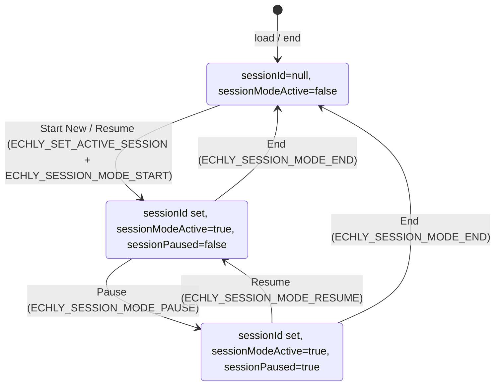

# Echly Extension — Session Runtime Map

**Purpose:** Read-only audit of the complete session state system. No code was modified. This document maps all session variables, ownership, message flows, and root causes of synchronization bugs.

**Symptoms referenced:**
- Fresh extension open shows "Session started" banner when no session exists
- Pause does not load full session tickets
- Session end leaves recorder bars active in other tabs
- Ticket trays differ between tabs

---

## SECTION 1 — All Session Variables

Every occurrence of the requested session-related identifiers, with file, line, purpose, and when the value changes.

### sessionId

| File | Line | Purpose | When it changes |
|------|------|---------|-----------------|
| echly-extension/src/background.ts | 13 | Module-level `activeSessionId` (source of truth in background) | ECHLY_SET_ACTIVE_SESSION, ECHLY_SESSION_MODE_END; restored from storage on load |
| echly-extension/src/background.ts | 35, 41, 59, 284, 311, 322, 333, 344, 418 | `globalUIState.sessionId` | Mirrored from activeSessionId on set/restore; set null on ECHLY_SESSION_MODE_END |
| echly-extension/src/content.tsx | 52, 76, 87, 172–198, 217–219, 331, 739, 754–778, 1331–1333, 1398 | `globalState.sessionId`, `effectiveSessionId = globalState.sessionId` | From ECHLY_GLOBAL_STATE / ECHLY_GET_GLOBAL_STATE; used for API and widget prop |
| echly-extension/src/content.tsx | 188, 197–198, 201–202, 763–764, 777–778 | Inside handlers that set `loadSessionWithPointers` | When loading feedback for a session (sync or Resume) |
| components/CaptureWidget/hooks/useCaptureWidget.ts | 121, 427, 1054 | Prop and effect deps | Passed from content; overlay created when `globalSessionModeActive && sessionId` |
| components/CaptureWidget/CaptureLayer.tsx | 31, 60, 76 | Prop `sessionIdProp`; overlay visibility | Show session overlay only when sessionId set |
| components/CaptureWidget/types.ts | (via CaptureWidgetProps) | Prop type | — |
| lib/intelligence/types.ts, lib/domain/feedback.ts, lib/repositories/*, app/(app)/dashboard/*, etc. | various | Domain/API sessionId | Not extension session state |

### activeSessionId

| File | Line | Purpose | When it changes |
|------|------|---------|-----------------|
| echly-extension/src/background.ts | 13, 57–59, 284, 343 | Background’s current session; persisted in chrome.storage.local | Restored on load; set by ECHLY_SET_ACTIVE_SESSION; set null by ECHLY_SESSION_MODE_END |
| echly-extension/src/background.ts | 288–294, 347–351 | Persisted with sessionModeActive, sessionPaused | Same lifecycle as above |

### sessionMode

| File | Line | Purpose | When it changes |
|------|------|---------|-----------------|
| components/CaptureWidget/hooks/useCaptureWidget.ts | 165, 175–180, 581, 633, 941, 960, 1007, 1016, 1054–1056, 1068, 1081, 1110, 1226, 1398 | Local widget state: “session overlay active” | setSessionMode(true) when globalSessionModeActive && sessionId, or globalSessionModeActive && loadSessionWithPointers; setSessionMode(false) when globalSessionModeActive === false |
| components/CaptureWidget/SessionOverlay.tsx | 26, 44, 49, 67–78, 97, 127, 142 | Props for overlay and SessionControlPanel | From useCaptureWidget state |
| components/CaptureWidget/CaptureLayer.tsx | 28, 49, 59, 76, 87 | Whether to show session overlay vs region capture | From widget state |

### sessionModeActive

| File | Line | Purpose | When it changes |
|------|------|---------|-----------------|
| echly-extension/src/background.ts | 36, 43, 50, 61, 239, 288, 292, 311, 322, 333, 346, 350 | Part of globalUIState; “session is active” globally | false on load and ECHLY_TOGGLE_VISIBILITY; true on ECHLY_SET_ACTIVE_SESSION, ECHLY_SESSION_MODE_*; false on ECHLY_SESSION_MODE_END |
| echly-extension/src/content.tsx | 53, 77, 1325, 1399 | Content’s copy of global state | Every ECHLY_GLOBAL_STATE / ECHLY_GET_GLOBAL_STATE |

### sessionPaused

| File | Line | Purpose | When it changes |
|------|------|---------|-----------------|
| echly-extension/src/background.ts | 37, 44, 50, 61, 239, 293, 321, 325, 334, 347, 351 | Part of globalUIState; “session is paused” | false on start/set active/resume; true on ECHLY_SESSION_MODE_PAUSE; false on end |
| echly-extension/src/content.tsx | 54, 78, 1326, 1400 | Content’s copy | Every ECHLY_GLOBAL_STATE |
| components/CaptureWidget/hooks/useCaptureWidget.ts | 166, 176–183, 592, 960–961, 1016, 1069, 1076, 1082, 1096–1099, 1111, 1182, 1399 | Local widget state; drives “Session paused” vs “Session started” | Synced from globalSessionPaused when session active; set true on pause, false on resume/end |
| components/CaptureWidget/SessionControlPanel.tsx | 72 | UI text | “Session paused” vs “Session started” |
| components/CaptureWidget/SessionOverlay.tsx | 27, 44, 50, 67–78, 97, 127, 143 | Props | From useCaptureWidget |

### sessionIdOverride

- **Not present** in the current codebase. `effectiveSessionId` is defined as `globalState.sessionId` only (content.tsx:87).

### effectiveSessionId

| File | Line | Purpose | When it changes |
|------|------|---------|-----------------|
| echly-extension/src/content.tsx | 87 | `effectiveSessionId = globalState.sessionId` | Whenever globalState is updated from background (ECHLY_GLOBAL_STATE / ECHLY_GET_GLOBAL_STATE) |
| echly-extension/src/content.tsx | 217, 219, 377, 389, 490, 539, 599, 651, 787, 796, 846, 896, 926, 970, 1025, 1050, 1302 | Used for API calls, ECHLY_FEEDBACK_CREATED filter, and CaptureWidget sessionId prop | Same as above |

### loadSessionWithPointers

| File | Line | Purpose | When it changes |
|------|------|---------|-----------------|
| echly-extension/src/content.tsx | 80–81, 134, 144, 197–202, 763–764, 777–778, 1320, 1319 | `{ sessionId, pointers } \| null`; tells widget to show session UI with preloaded tickets | Set when: (1) ECHLY_GLOBAL_STATE handler loads feedback for sessionId (limit 200); (2) onResumeSessionSelect fetches feedback and sets it; cleared on ECHLY_RESET_WIDGET, beforeunload, or when sessionId is null in global state |
| components/CaptureWidget/hooks/useCaptureWidget.ts | 128, 1067–1069, 1071–1073, 1081, 1107–1110, 1121–1127 | Prop; gates “session UI” (overlay + tray) in extension | When parent passes non-null after Resume or after ECHLY_GLOBAL_STATE sync load |
| components/CaptureWidget/types.ts | (CaptureWidgetProps) | Prop type | — |

---

## SECTION 2 — Session State Ownership

### Which component owns session state

- **background.ts**  
  - **Owns:** `activeSessionId`, `globalUIState.sessionId`, `globalUIState.sessionModeActive`, `globalUIState.sessionPaused`.  
  - Persists `activeSessionId`, `sessionModeActive`, `sessionPaused` in `chrome.storage.local`.  
  - Single source of truth for “is there an active session?” and “is it paused?”.  
  - Broadcasts via `ECHLY_GLOBAL_STATE`; does not read from content.

- **content.tsx**  
  - **Does not own** session lifecycle.  
  - **Holds:** `globalState` (copy of last ECHLY_GLOBAL_STATE), `loadSessionWithPointers` (per-tab: which session is loaded and with which pointers).  
  - **Derives:** `effectiveSessionId = globalState.sessionId`.  
  - Sends: ECHLY_SET_ACTIVE_SESSION, ECHLY_SESSION_MODE_START/PAUSE/RESUME/END.  
  - When it receives ECHLY_GLOBAL_STATE with a non-null sessionId, it may trigger an async fetch and set `loadSessionWithPointers` for that tab (so cards can differ per tab).

- **CaptureWidget.tsx**  
  - **Does not own** session state.  
  - Passes through props from content to useCaptureWidget.

- **useCaptureWidget.ts**  
  - **Does not own** global session state.  
  - **Owns local UI state:** `sessionMode`, `sessionPaused` (and refs), `pointers`, `sessionFeedbackPending`, etc.  
  - These are **derived/synced** from props: `globalSessionModeActive`, `globalSessionPaused`, `sessionId`, `loadSessionWithPointers`.  
  - Session overlay and “Session started/paused” bar are shown based on these props + local sync effects.

### Which layer should be the source of truth

- **Global session lifecycle** (session id, active, paused): **background** is and should remain the only source of truth. Content and widget must not persist or decide “session active” independently; they only reflect background and send commands (set active, start, pause, resume, end).
- **Per-tab “loaded session with pointers”**: **content** is the owner for that tab (loadSessionWithPointers). It is set when the user Resumes (content fetches and sets it) or when ECHLY_GLOBAL_STATE has a sessionId and content’s handler fetches feedback. This is why trays can diverge: each tab has its own loadSessionWithPointers and fetch timing/result.

---

## SECTION 3 — Trace: Session Start (“Start New Feedback Session”)

1. **User action:** User clicks “Start New Feedback Session” in the widget (command screen).
2. **Widget:** `startSession` in useCaptureWidget.ts (939–955). Guards: `stateRef.current === "idle"`, `!sessionModeRef.current`, `!globalSessionModeActive`. Then: `onCreateSession()` → content’s `createSession()`.
3. **Content:** `createSession()` (content.tsx 734–745): POST `/api/sessions` → gets `session.id` → `chrome.runtime.sendMessage({ type: "ECHLY_SET_ACTIVE_SESSION", sessionId: newSessionId })`.
4. **Background:** ECHLY_SET_ACTIVE_SESSION (282–296): sets `activeSessionId`, `globalUIState.sessionId`, `sessionModeActive = true`, `sessionPaused = false`, `chrome.storage.local.set(...)`, `broadcastUIState()`.
5. **Content:** Back in startSession path, content then calls `onActiveSessionChange(session.id)` (no sendMessage; that was already sent in createSession). Then widget calls `onSessionModeStart?.()` → `chrome.runtime.sendMessage({ type: "ECHLY_SESSION_MODE_START" })`.
6. **Background:** ECHLY_SESSION_MODE_START (307–316): `globalUIState.sessionModeActive = true`, `sessionPaused = false`, `globalUIState.sessionId = activeSessionId`, persist, broadcast.
7. **Broadcast:** All tabs receive `ECHLY_GLOBAL_STATE` with `sessionId`, `sessionModeActive: true`, `sessionPaused: false`.
8. **Content (each tab):** Message listener sets host visibility and dispatches CustomEvent; ContentApp’s handler calls `setGlobalState(s)`. If sessionId non-null and different from previous, content may start async fetch for feedback and eventually `setLoadSessionWithPointers({ sessionId, pointers })` (limit 200).
9. **Widget (useCaptureWidget):**  
   - Effect (1052–1058): `globalSessionModeActive && sessionId` → `setSessionMode(true)`, `createCaptureRoot()`.  
   - Effect (1064–1091): `globalSessionModeActive === true && loadSessionWithPointers` → setSessionMode(true), setSessionPaused(globalSessionPaused), createCaptureRoot if needed; if `globalSessionModeActive === false` → setSessionMode(false), removeCaptureRoot, etc.
10. **UI:** Capture root exists; CaptureLayer shows session overlay when `sessionMode && extensionMode && globalSessionModeActive && sessionIdProp`; SessionOverlay renders SessionControlPanel with “Session started” (sessionPaused false).

---

## SECTION 4 — Trace: Session Resume (“Resume Session”)

1. **User action:** User clicks Resume (or picks session in ResumeSessionModal). Content calls `onResumeSessionSelect(sessionId, options)`.
2. **Content:** content.tsx 751–786:  
   - `chrome.runtime.sendMessage({ type: "ECHLY_SET_ACTIVE_SESSION", sessionId })`.  
   - `apiFetch(\`/api/feedback?sessionId=...&limit=200\`)` → `setLoadSessionWithPointers({ sessionId, pointers })`, `loadedSessionIdRef.current = sessionId`.  
   - `chrome.runtime.sendMessage({ type: "ECHLY_SESSION_MODE_START" })`.  
   - Optionally fetch `/api/sessions/${sessionId}` and ECHLY_OPEN_TAB(session.url).
3. **Background:** ECHLY_SET_ACTIVE_SESSION and ECHLY_SESSION_MODE_START as in Section 3; persist and broadcast.
4. **sessionId propagation:** Background’s `globalUIState.sessionId` and `activeSessionId` are set; broadcast sends sessionId to all tabs.
5. **Pointer loading:** In the tab that called Resume, `loadSessionWithPointers` is set synchronously after the fetch (pointers from `/api/feedback?sessionId=...&limit=200`). Other tabs receive ECHLY_GLOBAL_STATE; their ECHLY_GLOBAL_STATE handler may run an async fetch for the same sessionId and later set `loadSessionWithPointers` (so other tabs get cards only after that async completes, and can fail or differ).
6. **Widget (useCaptureWidget):**  
   - loadSessionWithPointers effect (1121–1127): `setPointers(loadSessionWithPointers.pointers ?? [])`, `onSessionLoaded?.()` (content clears loadSessionWithPointers in content’s onSessionLoaded).  
   - globalSessionModeActive effect: setSessionMode(true), setSessionPaused(globalSessionPaused), createCaptureRoot if needed.
7. **Overlay activation:** Same as start: `sessionMode` true, capture root created, CaptureLayer shows SessionOverlay with SessionControlPanel (“Session started”).

---

## SECTION 5 — Trace: Session Pause (“Pause” clicked)

1. **User action:** User clicks Pause in the session recorder bar (SessionControlPanel).
2. **Widget:** `pauseSession` in useCaptureWidget.ts (957–1002). If pipeline is active, sets `pausePending` and waits (poll) until `pipelineActiveRef.current` is false, then calls `onSessionModePause?.()`.
3. **Content:** `onSessionModePause` → `chrome.runtime.sendMessage({ type: "ECHLY_SESSION_MODE_PAUSE" })`.
4. **Background:** ECHLY_SESSION_MODE_PAUSE (318–327): `globalUIState.sessionModeActive = true`, `globalUIState.sessionPaused = true`, `globalUIState.sessionId = activeSessionId`, persist, broadcast.
5. **State changes:** All tabs receive ECHLY_GLOBAL_STATE with sessionPaused: true. Content sets globalState. Widget gets globalSessionPaused true.
6. **Widget effects (useCaptureWidget):**  
   - (1064–1091): if globalSessionPaused === true → setSessionPaused(true), setPausePending(false).  
   - (1094–1103): when globalSessionPaused changes and session active → setSessionPaused(globalSessionPaused), if paused setPausePending(false), setExpandedId(null), setHighlightTicketId(null).
7. **Cards loading:** Cards are **not** reloaded on Pause. The tray shows whatever pointers were already in the widget (from loadSessionWithPointers or from ECHLY_GLOBAL_STATE-driven fetch). So “Pause does not load full session tickets” is expected in the current design: Pause only flips sessionPaused; it does not trigger a new fetch. Full tickets are loaded only at Resume (or when ECHLY_GLOBAL_STATE causes the content handler to fetch for sessionId).
8. **Overlay:** Session overlay stays visible; SessionControlPanel shows “Session paused” and Resume/End buttons; hover/click capture is disabled while paused.

---

## SECTION 6 — Trace: Session End (“End” clicked)

1. **User action:** User clicks End in SessionControlPanel.
2. **Widget:** `endSession` in useCaptureWidget.ts (1014–1049). If pipeline active, sets endPending and waits; then calls `onSessionModeEnd?.()` (and optional afterEnd).
3. **Content:** onSessionModeEnd (content.tsx 1336–1336): if `globalState.sessionId` exists, sends ECHLY_OPEN_TAB(dashboard URL); then `chrome.runtime.sendMessage({ type: "ECHLY_SESSION_MODE_END" })`.
4. **Background:** ECHLY_SESSION_MODE_END (341–355): `activeSessionId = null`, `globalUIState.sessionId = null`, `sessionModeActive = false`, `sessionPaused = false`, `chrome.storage.local.set(...)`, `broadcastUIState()`, `setTimeout(broadcastUIState, 150)`.
5. **Broadcast:** All tabs are sent ECHLY_GLOBAL_STATE with sessionId null, sessionModeActive false, sessionPaused false. Tabs where content script is not loaded or sendMessage fails do not receive the update.
6. **Content (receiving tabs):** setGlobalState(s); ECHLY_GLOBAL_STATE handler also sees sessionId === null → setLoadSessionWithPointers(null), clear refs, set expanded false.
7. **Widget cleanup (useCaptureWidget):** Effect (1081–1089): when globalSessionModeActive === false → setSessionMode(false), setSessionPaused(false), clear pending/timeouts, removeAllMarkers(), removeCaptureRoot().
8. **Overlay removal:** removeCaptureRoot() removes the capture root; SessionOverlay is no longer rendered for that tab.

**Why “Session started” bar sometimes reappears:**  
If a tab **never receives** the ECHLY_GLOBAL_STATE after ECHLY_SESSION_MODE_END (e.g. sendMessage to that tab failed, or tab was suspended), that tab still has the previous globalState with sessionModeActive true and sessionId set. So the widget in that tab still has globalSessionModeActive true and sessionId, and continues to show the session overlay and “Session started” bar. Recovery happens when that tab next gets fresh state: tab activation (onActivated sends ECHLY_GLOBAL_STATE) or visibility change (content requests ECHLY_GET_GLOBAL_STATE and reapplies). Until then, that tab’s UI is stale.

---

## SECTION 7 — Trace: Tab Switch (Tab A active session → user switches to Tab B)

1. **Background:** `chrome.tabs.onActivated` fires. Background sends to the newly active tab:  
   - `chrome.tabs.sendMessage(activeInfo.tabId, { type: "ECHLY_GLOBAL_STATE", state: globalUIState })`  
   - `chrome.tabs.sendMessage(activeInfo.tabId, { type: "ECHLY_SESSION_STATE_SYNC" })`
2. **Tab B (content):** Receives ECHLY_GLOBAL_STATE → setHostVisibility, setGlobalState (or __ECHLY_APPLY_GLOBAL_STATE__ + CustomEvent). Receives ECHLY_SESSION_STATE_SYNC → requests ECHLY_GET_GLOBAL_STATE and reapplies normalized state (visibility + dispatch CustomEvent).
3. **State updated:** Tab B’s globalState now matches background (sessionId, sessionModeActive, sessionPaused). If sessionId is non-null and different from Tab B’s previousSessionIdRef, the ECHLY_GLOBAL_STATE handler in content starts an async fetch for feedback and will later set loadSessionWithPointers for Tab B.
4. **Widget behavior (Tab B):** useCaptureWidget gets globalSessionModeActive and sessionId from props. Effects: (1052–1058) if globalSessionModeActive && sessionId → setSessionMode(true), createCaptureRoot(); (1066–1091) if globalSessionModeActive === true && loadSessionWithPointers → setSessionMode(true), setSessionPaused(…), createCaptureRoot(). So Tab B shows the overlay only after it has both globalSessionModeActive/sessionId and (for full UI) loadSessionWithPointers. loadSessionWithPointers for Tab B is set only when the async fetch from the ECHLY_GLOBAL_STATE handler completes (or from a previous load). If Tab B never had loadSessionWithPointers set (e.g. user never Resumed in Tab B and the async fetch hasn’t completed or failed), the “session UI” effect that sets sessionMode from loadSessionWithPointers doesn’t run; the overlay effect (1052–1058) only needs globalSessionModeActive && sessionId, so the bar can show with an empty or stale tray. **Tray divergence:** Tab A may have set loadSessionWithPointers when user Resumed there (full pointers); Tab B gets pointers only from the ECHLY_GLOBAL_STATE-driven fetch (limit 200, async). So Tab B’s tray can be empty briefly, different length, or different if the fetch failed or returned different data.

---

## SECTION 8 — Trace: Extension Open (user clicks extension icon)

1. **User action:** User clicks the extension icon. Popup opens (popup.html / PopupApp).
2. **Popup:** Gets auth state; if authenticated, may call `toggleVisibility()` and close. Toggle sends ECHLY_TOGGLE_VISIBILITY to background.
3. **Background:** ECHLY_TOGGLE_VISIBILITY (233–253): toggles `globalUIState.visible`. When visible becomes true: `globalUIState.expanded = false`; **session lifecycle is reset only in memory:** `globalUIState.sessionModeActive = false`, `globalUIState.sessionPaused = false`; `persistSessionLifecycleState()` (which saves activeSessionId, sessionModeActive, sessionPaused — and does **not** set activeSessionId to null). So **activeSessionId is preserved** for Resume. Then: send ECHLY_RESET_WIDGET to all tabs; then broadcastUIState().
4. **Content (each tab):** Receives ECHLY_RESET_WIDGET → CustomEvent → handler: setLoadSessionWithPointers(null), setWidgetResetKey(k => k+1), etc. Receives ECHLY_GLOBAL_STATE with visible true, sessionModeActive false, sessionPaused false, sessionId still equal to stored activeSessionId (because background did not clear it).
5. **Why “Session started” bar can appear when no session exists:**  
   - If a tab had **stale** globalState (e.g. it missed a previous ECHLY_SESSION_MODE_END or ECHLY_GLOBAL_STATE), it could still have sessionModeActive true. When the user opens the extension, that tab gets ECHLY_RESET_WIDGET and then ECHLY_GLOBAL_STATE. The new broadcast has sessionModeActive false, so after applying, that tab should correct.  
   - **Race/order:** If the tab applies ECHLY_RESET_WIDGET first (clearing loadSessionWithPointers and remounting widget), then receives ECHLY_GLOBAL_STATE with sessionId non-null (because background kept activeSessionId) and sessionModeActive false, the overlay effect (1052–1058) requires both globalSessionModeActive and sessionId — so overlay should not show.  
   - The remaining case is a tab that **never receives** the broadcast (e.g. tab in background, sendMessage failed). That tab keeps old globalState with sessionModeActive true and shows “Session started” until it next gets state (e.g. when user switches to that tab and onActivated sends state, or visibility change triggers ECHLY_GET_GLOBAL_STATE).

---

## SECTION 9 — State Divergence: Exact Points

Divergence between background, content, and widget occurs at these precise points:

1. **Background ↔ Content (any tab)**  
   - **Location:** chrome.tabs.sendMessage in broadcastUIState() and in onActivated/onCreated.  
   - **Mechanism:** sendMessage to a tab can fail (content script not loaded, tab discarded). The failure is caught and ignored (e.g. background.ts 198–200). That tab never receives ECHLY_GLOBAL_STATE, so its globalState (and thus effectiveSessionId, globalSessionModeActive, globalSessionPaused) stays stale.  
   - **File/function:** echly-extension/src/background.ts, `broadcastUIState()`.

2. **Content globalState ↔ Widget props**  
   - **Location:** Content passes `globalState.sessionModeActive`, `globalState.sessionPaused`, `sessionId={effectiveSessionId}`, `loadSessionWithPointers` to CaptureWidget.  
   - **Mechanism:** globalState is updated asynchronously (CustomEvent + setState). Widget may render with one set of props while content is already applying a new state; or the tab may have received a different ECHLY_GLOBAL_STATE than another tab.  
   - **File:** echly-extension/src/content.tsx (ContentApp state and CaptureWidget props).

3. **loadSessionWithPointers (tray) per tab**  
   - **Location:** content.tsx ECHLY_GLOBAL_STATE handler (164–209): when sessionId !== previousSessionIdRef, it starts an async apiFetch and later setLoadSessionWithPointers.  
   - **Mechanism:** Each tab computes its own loadSessionWithPointers. Tab A may have set it from Resume (same session, full fetch). Tab B gets it only when its ECHLY_GLOBAL_STATE handler runs and the async fetch completes. So Tab B can have loadSessionWithPointers null, or with different pointers (e.g. different limit, or fetch failed and pointers: []).  
   - **File/function:** echly-extension/src/content.tsx, handler inside `window.addEventListener("ECHLY_GLOBAL_STATE", ...)`.

4. **Widget sessionMode from globalSessionModeActive alone**  
   - **Location:** useCaptureWidget.ts effect at 1052–1058: `if (globalSessionModeActive && sessionId) { setSessionMode(true); createCaptureRoot(); }`.  
   - **Mechanism:** Overlay and “Session started” bar can show with only globalSessionModeActive and sessionId, without loadSessionWithPointers. So the bar can appear even when this tab has no (or empty) tray.  
   - **File/function:** components/CaptureWidget/hooks/useCaptureWidget.ts, useEffect [globalSessionModeActive, sessionId, createCaptureRoot].

---

## SECTION 10 — Session State Diagram

```
┌─────────────────────────────────────────────────────────────────────────────┐
│ BACKGROUND (echly-extension/src/background.ts)                               │
│                                                                              │
│  activeSessionId (module)  ──► globalUIState.sessionId                       │
│        │                            │                                         │
│        │                    globalUIState.sessionModeActive                   │
│        │                    globalUIState.sessionPaused                       │
│        ▼                            │                                         │
│  chrome.storage.local               │                                         │
│  (activeSessionId,                  │                                         │
│   sessionModeActive,                │                                         │
│   sessionPaused)                    │                                         │
│                                     ▼                                         │
│                          broadcastUIState()                                   │
│                          ECHLY_GLOBAL_STATE → all tabs (or onActivated/       │
│                          onCreated → single tab)                              │
└─────────────────────────────────────────────────────────────────────────────┘
                                        │
                    sendMessage (can fail per tab)
                                        │
                                        ▼
┌─────────────────────────────────────────────────────────────────────────────┐
│ CONTENT (echly-extension/src/content.tsx)                                    │
│                                                                              │
│  chrome.runtime.onMessage → setHostVisibility(state.visible)                 │
│                          → __ECHLY_APPLY_GLOBAL_STATE__?.(state)             │
│                          → dispatchEvent(ECHLY_GLOBAL_STATE)                 │
│                                                                              │
│  ContentApp:                                                                 │
│    globalState (useState)  ◄── ECHLY_GLOBAL_STATE / ECHLY_GET_GLOBAL_STATE     │
│         │                                                                     │
│         ├── sessionId, sessionModeActive, sessionPaused                       │
│         │                                                                     │
│         ▼                                                                     │
│    effectiveSessionId = globalState.sessionId                                │
│                                                                              │
│    loadSessionWithPointers (useState)  ◄── set by:                            │
│         │                                    • ECHLY_GLOBAL_STATE handler     │
│         │                                      (async fetch, limit 200)       │
│         │                                    • onResumeSessionSelect (fetch)  │
│         │                                    cleared: ECHLY_RESET_WIDGET,     │
│         │                                    sessionId null, beforeunload    │
│         ▼                                                                     │
│    <CaptureWidget sessionId={effectiveSessionId}                              │
│                    globalSessionModeActive={globalState.sessionModeActive}    │
│                    globalSessionPaused={globalState.sessionPaused}            │
│                    loadSessionWithPointers={loadSessionWithPointers} />       │
└─────────────────────────────────────────────────────────────────────────────┘
                                        │
                                        ▼
┌─────────────────────────────────────────────────────────────────────────────┐
│ WIDGET (useCaptureWidget.ts → CaptureWidget.tsx → CaptureLayer.tsx)          │
│                                                                              │
│  Props: sessionId, globalSessionModeActive, globalSessionPaused,              │
│        loadSessionWithPointers                                               │
│                                                                              │
│  Local state:                                                                 │
│    sessionMode (useState)   ◄── true when (globalSessionModeActive &&         │
│    sessionPaused (useState)      sessionId) or (globalSessionModeActive &&    │
│                                  loadSessionWithPointers); false when        │
│                                  globalSessionModeActive === false            │
│    pointers (useState)     ◄── loadSessionWithPointers.pointers, or           │
│                                  pipeline onSuccess, or [] on end            │
│                                                                              │
│  Effects:                                                                     │
│    • globalSessionModeActive && sessionId → setSessionMode(true),             │
│      createCaptureRoot()                                                      │
│    • globalSessionModeActive && loadSessionWithPointers → setSessionMode(true)│
│      setSessionPaused(globalSessionPaused), createCaptureRoot()                │
│    • globalSessionModeActive === false → setSessionMode(false),               │
│      removeCaptureRoot(), clear pending                                       │
│                                                                              │
│  UI: SessionControlPanel (“Session started” / “Session paused”) shown when    │
│      SessionOverlay rendered (sessionMode true, capture root exists)           │
└─────────────────────────────────────────────────────────────────────────────┘
```

**Message flow (session lifecycle):**

- Start: Content createSession → ECHLY_SET_ACTIVE_SESSION → ECHLY_SESSION_MODE_START → broadcast.
- Pause: Content → ECHLY_SESSION_MODE_PAUSE → broadcast.
- Resume: Content onResumeSessionSelect → ECHLY_SET_ACTIVE_SESSION + setLoadSessionWithPointers + ECHLY_SESSION_MODE_START → broadcast.
- End: Content → ECHLY_SESSION_MODE_END → background clears session → broadcast.
- Tab switch: onActivated → send ECHLY_GLOBAL_STATE + ECHLY_SESSION_STATE_SYNC to active tab.
- Extension open: ECHLY_TOGGLE_VISIBILITY → sessionModeActive/sessionPaused false (activeSessionId kept), ECHLY_RESET_WIDGET, broadcast.

**Session lifecycle (Mermaid):**



**Message flow (Start Session):**

```mermaid
sequenceDiagram
  participant User
  participant Widget
  participant Content
  participant Background
  participant Tabs
  User->>Widget: Start New Feedback Session
  Widget->>Content: onCreateSession()
  Content->>Content: POST /api/sessions
  Content->>Background: ECHLY_SET_ACTIVE_SESSION(sessionId)
  Background->>Background: set activeSessionId, globalUIState; persist
  Content->>Background: ECHLY_SESSION_MODE_START
  Background->>Background: sessionModeActive=true; persist
  Background->>Tabs: broadcastUIState() (ECHLY_GLOBAL_STATE)
  Tabs->>Content: setGlobalState(s)
  Content->>Widget: props (globalSessionModeActive, sessionId)
  Widget->>Widget: setSessionMode(true), createCaptureRoot()
  Widget->>User: Session bar + overlay
```

---

## SECTION 11 — Root Causes (file / function / state variable)

| Symptom | Root cause | File | Function / location | State variable / mechanism |
|--------|------------|------|----------------------|----------------------------|
| **False “Session started” banner** | Tab has stale globalState (sessionModeActive true) because it never received ECHLY_SESSION_MODE_END or later ECHLY_GLOBAL_STATE (sendMessage failed or tab not focused). Widget shows bar because sessionMode is true from that stale globalSessionModeActive and sessionId. | background.ts | broadcastUIState() — sendMessage to tab can fail and is ignored | content globalState; useCaptureWidget sessionMode |
| **Missing cards (Pause does not load full tickets)** | Pause only toggles sessionPaused in background and syncs to widget; it does not trigger a feedback fetch. Cards are loaded only when loadSessionWithPointers is set (Resume or ECHLY_GLOBAL_STATE handler). If the tab never had loadSessionWithPointers set (e.g. user didn’t Resume there, or ECHLY_GLOBAL_STATE fetch not yet done/failed), tray is empty or partial. | content.tsx | ECHLY_GLOBAL_STATE handler sets loadSessionWithPointers only when sessionId changes and async fetch completes; pauseSession in useCaptureWidget does not request cards | loadSessionWithPointers; pointers in useCaptureWidget |
| **Session not ending globally (recorder bars stay in other tabs)** | ECHLY_SESSION_MODE_END broadcasts to all tabs, but chrome.tabs.sendMessage to each tab can fail (e.g. tab without content script or tab discarded). Those tabs never get ECHLY_GLOBAL_STATE with sessionId null and sessionModeActive false, so they keep showing the session overlay. | background.ts | broadcastUIState() | globalUIState; content globalState per tab |
| **Tray inconsistencies between tabs** | Each tab has its own loadSessionWithPointers. Tab A: set by Resume (fetch in that tab). Tab B: set only when ECHLY_GLOBAL_STATE handler runs and its async fetch completes (limit 200). So Tab B can have no tray, fewer items, or different data; ECHLY_FEEDBACK_CREATED only appends in the tab where effectiveSessionId matches. | content.tsx | ECHLY_GLOBAL_STATE handler (async setLoadSessionWithPointers); ECHLY_FEEDBACK_CREATED handler (append only if sid === effectiveSessionId) | loadSessionWithPointers per tab; pointers in useCaptureWidget per tab |

---

## SECTION 12 — Output Summary

This document is the requested **extension-session-runtime-map**. It includes:

- **Section 1:** Every occurrence of sessionId, activeSessionId, sessionMode, sessionModeActive, sessionPaused, effectiveSessionId, loadSessionWithPointers (sessionIdOverride not present), with file, line, purpose, and when each changes.
- **Section 2:** Session state ownership: background as source of truth for global session lifecycle; content for per-tab loadSessionWithPointers; widget as consumer/sync only.
- **Sections 3–8:** Traces for Session Start, Resume, Pause, End, Tab Switch, and Extension Open, with messages, state changes, and UI updates.
- **Section 9:** Exact divergence points (broadcast failure, per-tab loadSessionWithPointers, overlay from globalSessionModeActive && sessionId without loadSessionWithPointers).
- **Section 10:** Architecture and message-flow description (state diagram and lifecycle).
- **Section 11:** Root causes for false session banner, missing cards, session not ending globally, and tray inconsistencies, with file, function, and state variable.

No fixes were applied; this is a read-only description of current runtime behavior.
