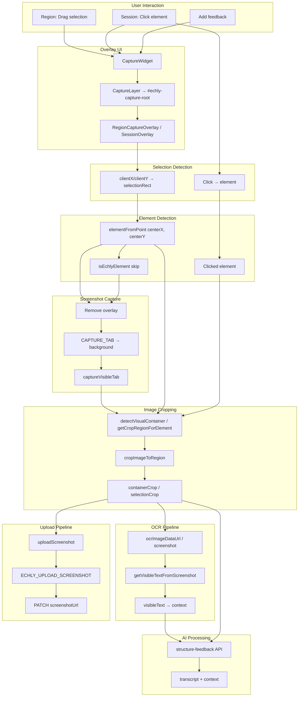

# Echly Chrome Extension — Full Capture Forensic Audit

**Date:** 2025-03-09  
**Goal:** Identify why screenshot capture sometimes produces incorrect regions (icon-only screenshots or black screenshots).  
**Scope:** Entire extension codebase. Investigation only — no code modifications.

---

## PART 1 — Extension Architecture Map

### Mermaid Flow Diagram



### System Architecture Diagram

```
┌─────────────────────────────────────────────────────────────────────────────────┐
│                           USER INTERACTION                                         │
├─────────────────────────────────────────────────────────────────────────────────┤
│  • Region mode: Drag selection → "Speak feedback"                                 │
│  • Session mode: Click element → Voice/text feedback                              │
│  • Non-extension: Add feedback → full viewport capture                            │
└─────────────────────────────────────────────────────────────────────────────────┘
                                        │
                                        ▼
┌─────────────────────────────────────────────────────────────────────────────────┐
│                           OVERLAY UI                                               │
├─────────────────────────────────────────────────────────────────────────────────┤
│  • CaptureWidget.tsx → CaptureLayer (createPortal into #echly-capture-root)      │
│  • Region mode: RegionCaptureOverlay (dim, cutout, confirm bar)                   │
│  • Session mode: SessionOverlay (element highlighter, click capture)              │
│  • Extension: Widget lives in shadow DOM (echly-shadow-host → echly-root)         │
│  • #echly-capture-root: pointer-events: none, z-index 2147483645                  │
└─────────────────────────────────────────────────────────────────────────────────┘
                                        │
                                        ▼
┌─────────────────────────────────────────────────────────────────────────────────┐
│                           SELECTION DETECTION                                      │
├─────────────────────────────────────────────────────────────────────────────────┤
│  Region mode:                                                                     │
│    • onMouseDown → startRef, selectionRect {x,y,w:0,h:0}                          │
│    • onMouseMove → selectionRectRef.current = {x,y,w,h} (clientX/clientY)        │
│    • onMouseUp → releasedRect if w,h >= MIN_SIZE (24px)                           │
│  Session mode:                                                                    │
│    • attachClickCapture (capture phase) → callback(element)                       │
│    • isSessionCaptureTarget(element) filters out Echly UI, inputs, body            │
└─────────────────────────────────────────────────────────────────────────────────┘
                                        │
                                        ▼
┌─────────────────────────────────────────────────────────────────────────────────┐
│                           ELEMENT DETECTION                                        │
├─────────────────────────────────────────────────────────────────────────────────┤
│  Region mode (performCapture):                                                    │
│    • centerX = targetRect.x + targetRect.w/2, centerY = targetRect.y + targetRect.h/2│
│    • element = document.elementFromPoint(centerX, centerY)                        │
│    • while (isEchlyElement(element)) element = element.parentElement || body       │
│    • element = element || document.body                                           │
│  Session mode: element = clicked target (from click event)                        │
└─────────────────────────────────────────────────────────────────────────────────┘
                                        │
                                        ▼
┌─────────────────────────────────────────────────────────────────────────────────┐
│                           SCREENSHOT CAPTURE                                       │
├─────────────────────────────────────────────────────────────────────────────────┤
│  • getFullTabImage() → captureTabWithoutOverlay(capture)                           │
│  • captureTabWithoutOverlay: remove #echly-capture-root, rAF, capture, restore     │
│  • capture: chrome.runtime.sendMessage({ type: "CAPTURE_TAB" })                   │
│  • background.ts: chrome.tabs.captureVisibleTab(windowId, {format:"png"})         │
│  • Returns: data URL (PNG), viewport dimensions in device pixels                  │
└─────────────────────────────────────────────────────────────────────────────────┘
                                        │
                                        ▼
┌─────────────────────────────────────────────────────────────────────────────────┐
│                           IMAGE CROPPING                                           │
├─────────────────────────────────────────────────────────────────────────────────┤
│  Region mode:                                                                     │
│    • containerRect = detectVisualContainer(element)                               │
│    • containerCrop = cropImageToRegion(fullImage, safeContainerRect, dpr)          │
│    • selectionCrop = cropImageToRegion(fullImage, clampRect(targetRect), dpr)      │
│    • onAddVoice(containerCrop, context) — containerCrop is uploaded                │
│  Session mode:                                                                    │
│    • cropped = cropScreenshotAroundElement(fullImage, element, 40)                 │
│    • getCropRegionForElement: rect = element.getBoundingClientRect(), + padding    │
└─────────────────────────────────────────────────────────────────────────────────┘
                                        │
                                        ▼
┌─────────────────────────────────────────────────────────────────────────────────┐
│                           OCR PIPELINE                                            │
├─────────────────────────────────────────────────────────────────────────────────┤
│  • imageForOcr = context?.ocrImageDataUrl ?? screenshot ?? null                    │
│  • Region: ocrImageDataUrl = selectionCrop (selection rect, not container)        │
│  • Session: ocrImageDataUrl not set → uses screenshot (container/element crop)    │
│  • getVisibleTextFromScreenshot(imageForOcr) → Tesseract.js                       │
│  • Result → context.visibleText (enriched for structure-feedback)                │
└─────────────────────────────────────────────────────────────────────────────────┘
                                        │
                                        ▼
┌─────────────────────────────────────────────────────────────────────────────────┐
│                           AI PROCESSING                                           │
├─────────────────────────────────────────────────────────────────────────────────┤
│  • structure-feedback API: transcript + context (no image in body)                │
│  • Screenshot NOT altered; only context (visibleText, domPath, etc.) used         │
└─────────────────────────────────────────────────────────────────────────────────┘
                                        │
                                        ▼
┌─────────────────────────────────────────────────────────────────────────────────┐
│                           UPLOAD PIPELINE                                          │
├─────────────────────────────────────────────────────────────────────────────────┤
│  • uploadScreenshot(screenshot, sessionId, screenshotId)                          │
│  • ECHLY_UPLOAD_SCREENSHOT → background → POST /api/upload-screenshot             │
│  • Variable uploaded: the screenshot passed to onComplete (containerCrop or cropped)│
│  • PATCH /api/tickets/:id { screenshotUrl } after upload resolves                 │
└─────────────────────────────────────────────────────────────────────────────────┘
```

---

## PART 2 — Screenshot Data Flow

| Stage | File | Function | Variable | Dimensions | Image Source |
|-------|------|----------|----------|------------|--------------|
| 1 | background.ts | CAPTURE_TAB handler | `result` (data URL) | viewport × DPR | `chrome.tabs.captureVisibleTab` |
| 2 | useCaptureWidget.ts | getFullTabImage | `response.screenshot` | viewport PNG | CAPTURE_TAB response |
| 3 | useCaptureWidget.ts | captureTabWithoutOverlay | (removes overlay, then capture) | — | — |
| 4 | RegionCaptureOverlay.tsx | performCapture | `fullImage` | viewport PNG | getFullTabImage() |
| 5 | RegionCaptureOverlay.tsx | cropImageToRegion | `containerCrop` | container rect × DPR | fullImage |
| 6 | RegionCaptureOverlay.tsx | cropImageToRegion | `selectionCrop` | selection rect × DPR | fullImage |
| 7 | RegionCaptureOverlay.tsx | performCapture | `onAddVoice(containerCrop)` | — | containerCrop |
| 8 | useCaptureWidget.ts | handleRegionCaptured | `recording.screenshot` | containerCrop | croppedDataUrl |
| 9 | content.tsx | handleComplete | `screenshot` | containerCrop | from onComplete |
| 10 | content.tsx | uploadScreenshot | `imageDataUrl` | containerCrop | screenshot |
| 11 | useCaptureWidget.ts | handleSessionElementClicked | `cropped` | element + padding | cropScreenshotAroundElement |
| 12 | useCaptureWidget.ts | setPending | `pending.screenshot` | element crop | cropped |
| 13 | content.tsx | handleComplete (session) | `pending.screenshot` | element crop | from pending |

---

## PART 3 — Cropping Operations

| File | Function | Region Input | Source Image | Result Variable |
|------|----------|--------------|--------------|-----------------|
| RegionCaptureOverlay.tsx | cropImageToRegion | region = {x,y,w,h} in CSS px | fullImageDataUrl | Promise\<string\> (data URL) |
| RegionCaptureOverlay.tsx | performCapture | safeContainerRect (from detectVisualContainer) | fullImage | containerCrop |
| RegionCaptureOverlay.tsx | performCapture | clampRect(targetRect) | fullImage | selectionCrop |
| cropAroundElement.ts | getCropRegionForElement | element.getBoundingClientRect() + padding | — | Region |
| cropAroundElement.ts | cropScreenshotAroundElement | getCropRegionForElement(element, 40) | fullImageDataUrl | cropImageToRegion result |

### cropImageToRegion Implementation (RegionCaptureOverlay.tsx:67–98)

```typescript
export async function cropImageToRegion(
  fullImageDataUrl: string,
  region: Region,
  dpr: number
): Promise<string> {
  return new Promise((resolve, reject) => {
    const img = new Image();
    img.crossOrigin = "anonymous";
    img.onload = () => {
      const sx = Math.round(region.x * dpr);
      const sy = Math.round(region.y * dpr);
      const sw = Math.round(region.w * dpr);
      const sh = Math.round(region.h * dpr);
      const canvas = document.createElement("canvas");
      canvas.width = sw;
      canvas.height = sh;
      const ctx = canvas.getContext("2d");
      ctx.drawImage(img, sx, sy, sw, sh, 0, 0, sw, sh);
      resolve(canvas.toDataURL("image/png"));
    };
    img.src = fullImageDataUrl;
  });
}
```

---

## PART 4 — Coordinate Systems

| Stage | Coordinate System | Units | Conversion Applied |
|-------|-------------------|-------|--------------------|
| selectionRect (mouse) | clientX, clientY | CSS pixels, viewport | None |
| targetRect / releasedRect | {x,y,w,h} | CSS pixels, viewport | None |
| getBoundingClientRect | viewport | CSS pixels | None |
| detectVisualContainer | getBoundingClientRect | CSS pixels | None |
| clampRect | viewport | CSS pixels | Clamps to 0..innerWidth, 0..innerHeight |
| cropImageToRegion | region × dpr | Device pixels | sx,sy,sw,sh = round(region.* × dpr) |
| captureVisibleTab | — | Device pixels | Chrome returns viewport in device px |
| getCropRegionForElement | rect.left, rect.top, rect.width, rect.height | CSS pixels | + padding, clamped to viewport |

**DPR usage:** `dpr = window.devicePixelRatio || 1` — applied when converting region to canvas drawImage source coordinates.

**Scroll:** `window.scrollX`, `window.scrollY` are captured in context but **not** used for crop coordinates. `getBoundingClientRect` is viewport-relative, which matches `captureVisibleTab` (viewport capture). Correct for viewport capture.

---

## PART 5 — Image Dimensions Verification

**Finding:** There is **no explicit validation** of `img.width` or `img.height` in the codebase.

- `cropImageToRegion` loads the image and uses `region * dpr` for source coordinates.
- Expected: `img.width === window.innerWidth * devicePixelRatio`, `img.height === window.innerHeight * devicePixelRatio`.
- If Chrome returns different dimensions (e.g. zoom, HiDPI, or platform quirks), crops could be misaligned or produce black/empty regions when `sx + sw > img.width` or `sy + sh > img.height`.
- `drawImage` with out-of-bounds source coordinates can produce black or partial pixels.

**Risk:** DPR or viewport mismatch between capture and crop math could cause incorrect crops.

---

## PART 6 — Overlay Interference

### Overlay Removal Mechanism

**Location:** `useCaptureWidget.ts` (captureTabWithoutOverlay) and `RegionCaptureOverlay.tsx` (performCapture)

```typescript
const overlay = document.getElementById("echly-capture-root");
let overlayParent = null, overlayNextSibling = null;
if (overlay && overlay.parentNode) {
  overlayParent = overlay.parentNode;
  overlayNextSibling = overlay.nextSibling;
  overlayParent.removeChild(overlay);
}
await new Promise(r => requestAnimationFrame(() => r()));
// ... capture ...
finally {
  if (overlayParent && overlay) {
    overlayParent.insertBefore(overlay, overlayNextSibling) || overlayParent.appendChild(overlay);
  }
}
```

### Critical Finding: Shadow DOM and getElementById

- **content.tsx:1316:** `#echly-capture-root lives in shadow DOM`
- The extension mounts the widget inside `echly-shadow-host` → shadow root → `echly-root` → `echly-capture-root`.
- **`document.getElementById("echly-capture-root")`** may **not** find elements inside shadow roots in some browsers (spec behavior varies; some implementations do not traverse shadow trees).
- If `getElementById` returns `null`, the overlay is **never removed** before capture.
- Result: capture includes the overlay (dim, cutout, UI), which can produce dark or incorrect screenshots.

### Compositor / Visibility

- Overlay is removed from DOM; no `visibility` or `opacity` toggle.
- A single `requestAnimationFrame` is used before capture; one frame may be insufficient for full compositor update on some devices.
- No additional delay beyond rAF.

---

## PART 7 — Element Detection

### Region Mode (RegionCaptureOverlay.tsx:194–205)

```typescript
const centerX = targetRect.x + targetRect.w / 2;
const centerY = targetRect.y + targetRect.h / 2;
let element = document.elementFromPoint(centerX, centerY);
while (element && isEchlyElement(element)) {
  element = element.parentElement || document.body;
}
element = element || document.body;
```

**Critical timing:** `elementFromPoint` is called **after** the overlay is restored in the `finally` block. The overlay covers the viewport, so `elementFromPoint(centerX, centerY)` typically hits the overlay first. After walking up past Echly elements, the code often reaches `document.body` (because `echly-root.parentElement` is `null` inside shadow DOM). So `element` becomes `document.body`, and `detectVisualContainer(body)` yields the body rect, which is then clamped to the viewport. The **container crop** becomes the full viewport, not the semantic container around the selection.

### Session Mode (clickCapture.ts + sessionMode.ts)

- Element comes from the click event target.
- `isSessionCaptureTarget` excludes: body, Echly UI, inputs, textareas, selects, contenteditable.
- `host.contains(element)` with `echly-shadow-host` excludes elements inside the extension UI.

---

## PART 8 — Container Detection

### detectVisualContainer (RegionCaptureOverlay.tsx:11–46)

```typescript
function detectVisualContainer(el: Element): DOMRect {
  const viewportW = window.innerWidth;
  const viewportH = window.innerHeight;
  let node = el;
  let bestRect = el.getBoundingClientRect();
  while (node && node !== document.body) {
    const rect = node.getBoundingClientRect();
    const style = window.getComputedStyle(node);
    const isLayoutContainer = style.display === "flex" || style.display === "grid" || style.display === "block";
    const widthRatio = rect.width / viewportW;
    const heightRatio = rect.height / viewportH;
    const goodContainer = widthRatio > 0.65 || heightRatio > 0.35 || isLayoutContainer;
    if (goodContainer) bestRect = rect;
    if (widthRatio > 0.85 || heightRatio > 0.6) break;
    node = node.parentElement;
  }
  return bestRect;
}
```

- Walks from `el` up to `body`.
- Prefers nodes with `widthRatio > 0.65` or `heightRatio > 0.35` or flex/grid/block.
- Stops when `widthRatio > 0.85` or `heightRatio > 0.6`.

**Session mode:** Does **not** use `detectVisualContainer`. Uses `getCropRegionForElement` (element rect + 40px padding). Clicking a small icon yields a small crop (icon + padding) → **icon-only screenshots**.

---

## PART 9 — Final Image Sent to Server

### Region Mode

- `onAddVoice(containerCrop, context)` → `handleRegionCaptured(croppedDataUrl, context)` → `recording.screenshot = croppedDataUrl`
- `onComplete(transcript, active.screenshot, ...)` → `screenshot` = `containerCrop`
- `uploadScreenshot(screenshot, ...)` uploads **containerCrop**.

### Session Mode

- `setPending({ screenshot: cropped, ... })` where `cropped = cropScreenshotAroundElement(fullImage, element)`
- `onComplete(transcript, pending.screenshot, ...)` → uploads **element crop** (element + 40px padding).

### Verification

- **Region mode:** `containerCrop` is uploaded (from `detectVisualContainer`, which may be body when `elementFromPoint` hits overlay).
- **Session mode:** Element crop is uploaded (no `detectVisualContainer`; small elements → small crops).

---

## PART 10 — OCR Pipeline Verification

- `context.ocrImageDataUrl` is set in RegionCaptureOverlay: `context.ocrImageDataUrl = selectionCrop`.
- `imageForOcr = ctx?.ocrImageDataUrl ?? screenshot ?? null`.
- OCR runs on `imageForOcr`; result goes to `visibleText`.
- The **screenshot** passed to `uploadScreenshot` is **not** overridden by OCR; OCR only affects `visibleText` in the context.
- **Conclusion:** OCR does not alter the screenshot; it only enriches context.

---

## PART 11 — AI Pipeline Verification

- `structure-feedback` receives `{ transcript, context }`; no image in the request body.
- Screenshot is uploaded separately via `uploadScreenshot` and attached via PATCH.
- **Conclusion:** AI pipeline does not modify the screenshot.

---

## PART 12 — Root Cause Analysis

### Where the Screenshot Becomes Incorrect

| Issue | Mode | Severity | Description |
|-------|------|----------|-------------|
| **1. getElementById + Shadow DOM** | Both | High | `#echly-capture-root` lives in shadow DOM. If `document.getElementById` does not traverse shadow roots, the overlay is never removed. Capture then includes the overlay (dim, cutout) → dark or incorrect screenshots. |
| **2. elementFromPoint After Overlay Restore** | Region | High | `elementFromPoint` runs after the overlay is restored. The overlay is on top, so the hit target is usually the overlay. Walking up past Echly elements leads to `body`. `detectVisualContainer(body)` yields the full viewport. The container crop is viewport-wide instead of the semantic container. |
| **3. Session Mode: No detectVisualContainer** | Session | High | Session mode crops to `element + 40px` only. Clicking a small icon produces an icon-sized crop → **icon-only screenshots**. |
| **4. No Image Dimension Validation** | Both | Medium | No check that `img.width/height` match `innerWidth*DPR` and `innerHeight*DPR`. Mismatches can cause `drawImage` to sample out of bounds → black or wrong regions. |
| **5. Race / Compositor Timing** | Both | Low | Single `requestAnimationFrame` before capture may be insufficient for compositor updates on some devices. |
| **6. Incorrect Container Detection** | Region | Medium | When `element === body`, `detectVisualContainer` returns body rect. Clamping to viewport gives full viewport; semantic container around the selection is lost. |

### Summary

- **Icon-only screenshots:** Session mode crops to the clicked element + padding. Small elements (icons) produce small crops.
- **Black screenshots:** Likely overlay not removed (shadow DOM + `getElementById`), or image dimension/coordinate mismatch in `cropImageToRegion`.
- **Wrong region:** Region mode uses `elementFromPoint` after overlay restore, often hitting overlay → body → full viewport instead of the intended container.

---

## Recommendations (Investigation Only — Not Implemented)

1. **Overlay removal:** Use a ref or `captureRootRef.current` instead of `getElementById` when the capture root is in shadow DOM.
2. **elementFromPoint timing:** Call `elementFromPoint` before restoring the overlay, or hide the overlay (e.g. `visibility: hidden`) instead of removing it so it does not receive hits.
3. **Session mode:** Use `detectVisualContainer` (or equivalent) in session mode so the crop includes the semantic container, not just the clicked element.
4. **Image validation:** In `cropImageToRegion`, validate `img.naturalWidth` and `img.naturalHeight` against expected viewport × DPR before cropping.
5. **Overlay removal timing:** Consider a short delay (e.g. 50–100 ms) after overlay removal before capture to allow compositor updates.
